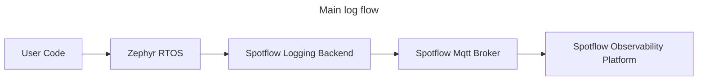
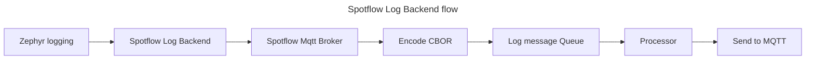

# Spotflow Observability Device SDK

Device SDK for Spotflow embedded observability platform.

This SDK provides a set of tools and libraries for [Zephyr RTOS](https://www.zephyrproject.org/) to
send your logs to the Spotflow observability platform.

Device SDK is integrated with the Zephyr as a module that contains the Spotflow Logging backend
that seamlessly integrates with the Zephyr logging subsystem.

## Getting Started

Register and get your Ingest key at [Spotflow](https://spotflow.io/).

Follow the Quickstart guide that is available in our portal after registration.

Alternatively, you can check sample applications in the [samples](zephyr/samples).
The sample was tested on NXP board FRDM-RW612 and Nordic board NRF7002DK.
The device SDK is ment to be used as
a [Zephyr module](https://docs.zephyrproject.org/latest/develop/modules.html).
You can add it to your Zephyr project by adding the following line to your `west.yml`:

```yaml
manifest:
    projects:
    - name: spotflow
      path: modules/lib/spotflow
      url: https://github.com/spotflow-io/device-sdk
```

## Documentation

### Architecture





## Feedback
Any comments, suggestions, or issues. Create a Github issue or contact us at hello@spotflow.io, [LinkedIn](https://www.linkedin.com/company/spotflow/) or [Discord](https://discord.gg/yw8rAvGZBx)
