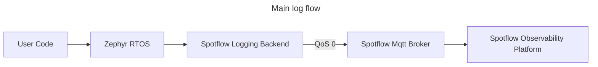
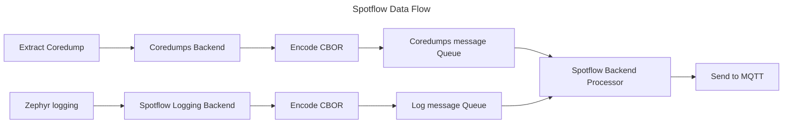
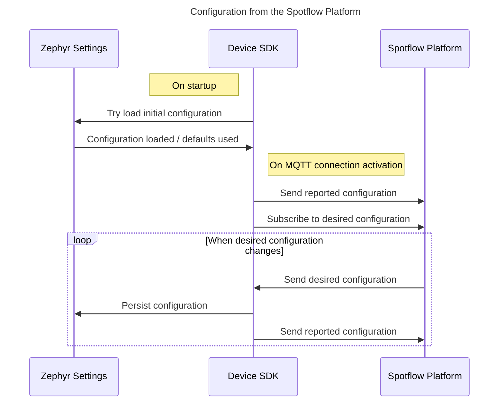

# Spotflow Observability Device SDK

Device SDK for Spotflow embedded observability platform.

This SDK provides a set of tools and libraries for [Zephyr RTOS](https://www.zephyrproject.org/) to
send your logs to the Spotflow observability platform.

Device SDK is integrated with Zephyr as a module that contains the Spotflow logging backend
that seamlessly integrates with the Zephyr logging subsystem.

Our solution was tested on the following Zephyr boards (more are coming soon):
* [ESP32-C3-DevKitC](https://docs.espressif.com/projects/esp-dev-kits/en/latest/esp32c3/esp32-c3-devkitc-02/index.html)
* [ESP32-C6-DevKitC](https://docs.espressif.com/projects/esp-dev-kits/en/latest/esp32c6/esp32-c6-devkitc-1/index.html)
* [ESP32-S3-DevKitC](https://docs.espressif.com/projects/esp-dev-kits/en/latest/esp32s3/esp32-s3-devkitc-1/index.html)
* [Infineon CY8CProto-062-4343W](https://www.infineon.com/evaluation-board/CY8CPROTO-062-4343W)
* [Nordic nRF7002DK](https://www.nordicsemi.com/Products/Development-hardware/nRF7002-DK)
* [NXP FRDM-RW612](https://www.nxp.com/design/microcontrollers/arm-cortex-m/rw6xx-rtos-ready-wireless-mcus:FRDM-RW612)
* [Raspberry Pi Pico 2 W](https://www.raspberrypi.com/documentation/microcontrollers/pico-series.html#pico2w-technical-specification)

We currently support:
* Zephyr 3.7.x, 4.1.x, 4.2.x, and 4.3.x
* nRF Connect SDK 3.0.x and 3.1.x

For more information, check [Spotflow](https://app.spotflow.io/) or [Spotflow documentation](https://docs.spotflow.io/).

## Getting Started

Register and get your Ingest key at [Spotflow](https://spotflow.io/signup).

Follow the Quickstart guide that is available in our portal after registration.

Alternatively, you can check sample applications in the [samples](zephyr/samples).
The device SDK is meant to be used as
a [Zephyr module](https://docs.zephyrproject.org/latest/develop/modules.html).
You can add it to your Zephyr project by adding the following line to your `west.yml`:

```yaml
manifest:
    projects:
    - name: spotflow
      path: modules/lib/spotflow
      revision: main
      url: https://github.com/spotflow-io/device-sdk
```

## Documentation

### Architecture

#### Logging


Currently, the Spotflow backend uses MQTT QoS 0 only.



#### Configuration

Most properties of the device SDK are currently configured in build time using Kconfig - see the help text of each option for more information.

The device SDK also provides a way to dynamically configure certain properties from the cloud using the Spotflow portal.
Currently, there is only one such property:

- **Minimal severity of sent log messages** (the *level* of sent log messages)

The configuration process uses the mechanism of *desired* and *reported* values that are stored for each device in the Spotflow platform and are synchronized using the MQTT protocol.
If Zephyr Settings subsystem is enabled, the device SDK uses it to persist the last active configuration.



### Build ID

In order to match core dumps with symbol files, our Zephyr module provides a piece of information called build ID.
The build ID is computed as a hash of the bytes loaded to the device; therefore, it uniquely identifies the firmware image.
Our Zephyr module adds a build command that computes the build ID and patches it into the `.elf` file as the following [binary descriptor](https://docs.zephyrproject.org/latest/services/binary_descriptors/index.html):

- **ID**: `0x5f0` (`5f` resembles `sf` - **S**pot**f**low, `0` stands for our first binary descriptor ID)
- **Type**: `bytes`
- **Length**: `20`

You can retrieve the build ID from the `.elf` file using the following command:

```bash
west bindesc custom_search BYTES 0x5f0 zephyr.elf
```

> **Note:** If the architecture of the device doesn't support binary descriptors (notably, ESP32), retrieving the build ID from the `.elf` file is more complex.
> In this case, it's necessary to use the symbol table, see the function `get_build_id_from_elf` in script tests.

Because Zephyr doesn't allow to insert a post-build command between the compilation of `zephyr.elf` and the generation of derived files such as `zephyr.hex` and `zephyr.bin`, our build command patches these files as well.
In particular, the files with the following extensions are patched:

- `.elf`
- `.hex`
- `.bin`
- `.strip`
- `.exe` when **not** targeting [native simulator](https://docs.zephyrproject.org/latest/boards/native/native_sim/doc/index.html) (it's just a copy of the `.elf` file)

The files with the following extensions (and others that might be introduced in the future) are **not** patched, so the build IDs stored in them are filled with zeros:

- `.lst` (assembly listing)
- `.uf2`
- `.s19`
- `.exe` when targeting [native simulator](https://docs.zephyrproject.org/latest/boards/native/native_sim/doc/index.html)

## Feedback
Any comments, suggestions, or issues are welcome.
Create a Github issue or contact us at hello@spotflow.io,
[LinkedIn](https://www.linkedin.com/company/spotflow/) or [Discord](https://discord.gg/yw8rAvGZBx).
