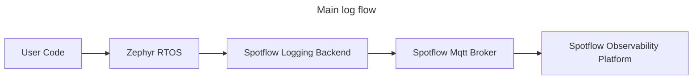
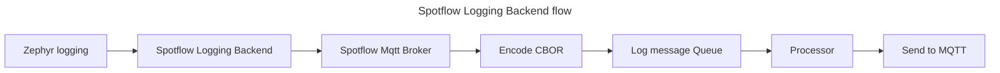

# Spotflow Observability Device SDK

Device SDK for Spotflow embedded observability platform.

This SDK provides a set of tools and libraries for [Zephyr RTOS](https://www.zephyrproject.org/) to
send your logs to the Spotflow observability platform.

Device SDK is integrated with the Zephyr as a module that contains the Spotflow logging backend
that seamlessly integrates with the Zephyr logging subsystem.

Our solution was tested on following Zephyr boards (more are coming soon):
* [NXP FRDM-RW612](https://www.nxp.com/design/microcontrollers/arm-cortex-m/rw6xx-rtos-ready-wireless-mcus:FRDM-RW612)
* [Nordic NRF7002DK](https://www.nordicsemi.com/Products/Development-hardware/nRF7002-DK)
* [ESP32-C3-DevKitC](https://docs.espressif.com/projects/esp-dev-kits/en/latest/esp32c3/esp32-c3-devkitc-02/index.html)

## Getting Started

Register and get your Ingest key at [Spotflow](https://spotflow.io/).

Follow the Quickstart guide that is available in our portal after registration using west init with our manifest:


[//]: # (TODO: Update revision)
```bash
mkdir spotflow-zephyr
python -m venv .\spotflow-zephyr\.venv
.\spotflow-zephyr\.venv\Scripts\Activate.ps1
pip install west
west init -m https://github.com/spotflow-io/device-sdk --mr feature/pinned_zephyr --mf west-zephyr.yml spotflow-zephyr
```

Alternatively, you can check sample applications in the [samples](zephyr/samples).
The device SDK is ment to be used as
a [Zephyr module](https://docs.zephyrproject.org/latest/develop/modules.html).
You can add it to your Zephyr project by adding the following line to your `west.yml`:

```yaml
manifest:
    projects:
    - name: spotflow
      path: modules/lib/spotflow
      revision: main
      url: https://github.com/spotflow-io/device-sdk
```

## Documentation

### Architecture





## Feedback
Any comments, suggestions, or issues are welcome.
Create a Github issue or contact us at hello@spotflow.io,
[LinkedIn](https://www.linkedin.com/company/spotflow/) or [Discord](https://discord.gg/yw8rAvGZBx).
