# Spotflow Observability IOT Devices

Device Component for Spotflow embedded observability platform.

This Component provides a set of tools and libraries for [ESP IDF]() to
send your logs to the Spotflow observability platform.

It is integrated with ESP IDF as a component which utilizes the ESP IDF logging component to seamlessly integrate with current firmwares.

Our solution was tested on the following Espressif boards (more are coming soon):
* [ESP32-S3]()
* [ESP32-C3]()
* [ESP32-C6]()

We currently support:
* ESP IDF v5.x.x
* Zephyr 4.1.x, 4.2.x, and 4.3.x
* nRF Connect SDK 3.0.x and 3.1.x

For more information, check [Spotflow](https://app.spotflow.io/) or [Spotflow documentation](https://docs.spotflow.io/).

## Getting Started

Register and get your Ingest key at [Spotflow](https://spotflow.io/signup).

Follow the Quickstart guide that is available in our portal after registration.

Alternatively, you can check example applications in the [examples]().
The Component is meant to be used as
a [ESP IDF component](https://docs.espressif.com/projects/idf-component-manager/en/latest/).
You can add it to your ESP IDF project by running the following command.

```code
idf.py add-dependency "spotflow/device_sdk"
```
and adding the following header file in your main file
```C
#include "spotflow.h"
```
in your starting or intial main task.
```C
spotflow_init();
```


## Component Size Default
### Without Coredump

| Archive File  | Total Size | DRAM | .bss | .data | IRAM | .text | .vectors | Flash Code | .text | Flash Data | .rodata |
|---------------|------------|------|------|-------|------|-------|----------|------------|-------|------------|---------|
| libspotflow.a | 7009       | 373  | 372  | 1     | 0    | 0     | 0        | 4633       | 4633  | 2003       | 2003    |

### With Coredump

| Archive File  | Total Size | DRAM | .bss | .data | IRAM | .text | .vectors | Flash Code | .text | Flash Data | .rodata |
|---------------|------------|------|------|-------|------|-------|----------|------------|-------|------------|---------|
| libspotflow.a | 8562       | 406  | 405  | 1     | 0    | 0     | 0        | 6153       | 6153  | 2003       | 2003    |


### Configurations
Details on the configuration to add in the sdkconfig if required.

- SPOTFLOW_LOG_BACKEND_SET_RUNTIME_FILTERING : If disabled, cloud based config only controls the logs going to the spotflow cloud. rest of the logs are printed on the terminal or other logging backends.
- SPOTFLOW_ERASE_NVS_FLASH: If disabled it doesn't erase the flash in case of persistence save fails.
- SPOTFLOW_COREDUMP_BACKEND: Enable or disable whether the coredump is created and sent to cloud backend.
- SPOTFLOW_COREDUMPS_CHUNK_SIZE: Coredump is divided into multiple chunks so reading and sending them to cloud can be made easier. Default is 2048 bytes can be reduced to like 256 but it will take a long while to upload. Keep it less than MQTT buffer.
- SPOTFLOW_MAX_QUEUE_SIZE: It takes a little while for coredump to read from flash and prepare it for transit. keep it small so when network connection is formed it sends all the queued buffers first before reading any more.

### Spotflow Main Log Flow


### Spotflow Data Flow


#### Configuration

Most properties of the Component are currently configured in build time using Kconfig - see the help text of each option for more information.

The Component also provides a way to dynamically configure certain properties from the cloud using the Spotflow portal.
Currently, there is only one such property:

- **Minimal severity of sent log messages** (the *level* of sent log messages)

The configuration process uses the mechanism of *desired* and *reported* values that are stored for each device in the Spotflow platform and are synchronized using the MQTT protocol.
If ESP IDF NVS storage is enabled, the Component uses it to persist the last active configuration.

### Spotflow Backend Flow


### Coredump
It uses the default coredump component from esp idf. [espcoredump](https://docs.espressif.com/projects/esp-idf/en/stable/esp32/api-guides/core_dump.html). If you get any not enought memory errors to save coreudmp increase the coredump parttion size in the partition.csv file.
If **Flash Encryption** is enabled add the encrypted flag to the coredump partition in partitions.csv. Nothing else is required.

## Feedback
Any comments, suggestions, or issues are welcome.
Create a Github issue or contact us at hello@spotflow.io,
[LinkedIn](https://www.linkedin.com/company/spotflow/) or [Discord](https://discord.gg/yw8rAvGZBx).
