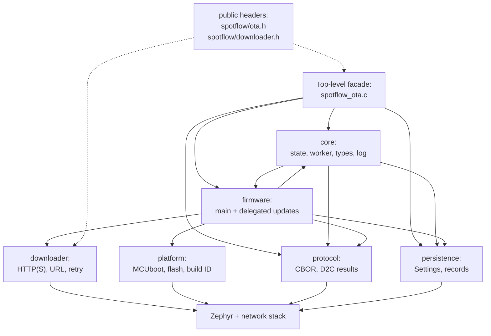

# Zephyr OTA updates— implementation design notes

This document summarizes important design decisions on the implementation of over-the-air updates.

## Module map

The repository [README](../../README.md#ota-updates) provides a high-level overview of the OTA implementation while the text below describes the individual folders and files.
The relevant source files are split by responsibility under `spotflow/zephyr/src/ota`:

| Folder | Responsibility |
|---|---|
| `.` | Public facade (`spotflow_ota.c` / `.h`), Kconfig, and OTA source list |
| `core/` | In-memory attempt/artifact state, worker orchestration, internal shared types, limits, logging |
| `protocol/` | OTA MQTT protocol encode/decode and pending D2C result publishing |
| `persistence/` | Zephyr Settings load/save and CBOR encoding of persisted records |
| `downloader/` | Public downloader API, URL parsing, HTTP transport, retry, pause/resume/cancel |
| `firmware/` | Automatic main-firmware lifecycle and delegated firmware callback dispatch |
| `platform/` | Zephyr/MCUboot/build-ID wrappers that are faked in tests |

Dependencies between folders:



The diagram shows code dependencies, not thread ownership.
`core/spotflow_ota_worker.c` orchestrates most runtime work and intentionally calls into several folders; lower-level folders should avoid calling back into the facade.
The dotted lines show implementations of public headers.

Important files:

| Module | Responsibility |
|---|---|
| `spotflow_ota.c` | Public facade; delegates to internal modules; idempotent init |
| `core/spotflow_ota_state.c` | In-memory attempt/artifact state; mutex-protected transitions |
| `core/spotflow_ota_worker.c` | Dedicated worker thread; artifact sequencing and job dispatch |
| `protocol/spotflow_ota_cbor.c` | C2D decode / D2C encode; protocol limits and attempt errors |
| `protocol/spotflow_ota_net.c` | Pending D2C merge and MQTT publish wrapper |
| `persistence/spotflow_ota_persistence.c` | Zephyr Settings load/save for attempt, results, versions, probation |
| `persistence/spotflow_ota_records_cbor.c` | CBOR encoding of persisted records |
| `downloader/spotflow_ota_downloader.c` | Public downloader API; in-process HTTP Range retry loop; pause/resume/cancel |
| `downloader/spotflow_ota_downloader_transport_errors.c` | Transient download-error classification (`transient_failure` on transport attempts) |
| `downloader/spotflow_ota_downloader_transport_socket.c` | Socket/TLS HTTP transport for downloads |
| `platform/spotflow_ota_platform.c` | MCUboot confirm, test upgrade, reboot, flash slot access |
| `platform/spotflow_ota_identity.c` | Running and downloaded image build ID reads |
| `firmware/spotflow_ota_fw_main.c` | Automatic main firmware pre/post-reboot flow |
| `firmware/spotflow_ota_fw_custom.c` | Delegated firmware dispatch; weak default callbacks; cancel work item |

MQTT subscription and inbound routing live in `spotflow_mqtt.c` / `spotflow_processor.c`.
C2D payloads are decoded on the MQTT thread; all durable work is handed to the OTA worker.

## Initialization

OTA uses a **defensive initialization** model: `spotflow_ota_init()` is idempotent,
mutex-protected, and safe to call from more than one entry point.

**Primary path (Spotflow processor)**

1. `spotflow_mqtt_thread_entry()` calls `spotflow_ota_init()` once before the first
   session metadata publish. This loads Settings, restores in-memory state, starts the OTA
   worker, and (when automatic main-firmware handling is enabled) runs post-reboot
   reconciliation.
2. After MQTT connects, `spotflow_ota_init_session()` calls `spotflow_ota_init()` again
   (no-op if already initialized) and registers the OTA C2D subscription.

`spotflow_ota_init()` does not require MQTT to be connected.

**Defensive path (application / public API)**

Every public facade API in `spotflow/ota.h` that reads or changes OTA state calls
`spotflow_ota_init()` first.

User-implemented callbacks (`spotflow_on_handle_firmware_update`, and so on) are not
included; the SDK invokes those after init has already run.

This lets application and delegated-firmware code use the public API without calling
internal init functions, even if it runs before the MQTT session is established (for
example post-reboot confirmation in `main()`, or `spotflow_is_update_canceled()` inside a
download handler after reboot).

## Threading and synchronization

```
MQTT thread     → decode C2D, enqueue worker jobs, poll pending D2C send
OTA worker      → state transitions, artifact handlers, spotflow_download_artifact()
sysworkq        → spotflow_on_update_canceled()
App threads     → public API (pause/resume/fail/confirm/query)
```

`spotflow_download_artifact()` is synchronous: it blocks its caller until the download finishes, is canceled, or fails.
When the main firmware is handled automatically, its download always runs on the OTA worker thread.
When the user code implements a custom firmware handler, the download will run on the OTA worker thread, too, unless it is explicitly delegated to a different thread.

**Rules:**

- `state_mutex` protects in-memory attempt state only.
- No user callbacks, persistence, network, downloader, flash, or MQTT while holding
  `state_mutex`.
- Public API calls update state under the mutex, release it, then perform I/O or wake the
  worker.
- Main-firmware progress callbacks fire from the OTA worker after state changes, not from
  the calling application thread.

Cancellation uses `sysworkq` because the OTA worker may be blocked inside
`spotflow_on_handle_firmware_update()`. A work item calls `spotflow_on_update_canceled()`
without holding `state_mutex`.

## Attempt and artifact state model

**Attempts**

- One **current** attempt in RAM and persistence.
- One **pending newer** attempt in RAM only (not fully persisted as a second active
  attempt). Promoted when supersession is safe.

**Artifacts**

- Processed strictly in manifest order.
- Each artifact has a terminal result: `SUCCEEDED`, `FAILED`, or `CANCELED`, or is still
  in progress.

**Inbound message handling**

| Condition | Behavior |
|---|---|
| Duplicate same `updateAttemptId` | Ignored |
| New attempt while current is terminal | Accept and start |
| New attempt while current is unfinished | Stash one pending newer attempt; supersede the current one when safe (after finishing the current artifact or rebooting) |
| Malformed message, unable to parse attempt ID | Logged and ignored |
| Malformed message, able to parse attempt ID | Rejected with `updateAttemptError` |

**Supersession**

When a newer manifest arrives mid-attempt, the worker stops the current artifact when it
can do so safely (for example between download chunks or before starting the next
artifact). Terminal results for the superseded attempt are persisted locally but are **not**
reported to the cloud; processing continues with the promoted attempt.

A malformed `UPDATE_ARTIFACTS` message with a trustworthy but different attempt ID
follows the same supersession path: the rejection (`updateAttemptError`) is stored in the
single pending slot and reported only after the superseded attempt reaches terminal
results and is promoted. The superseded attempt's per-artifact results are not reported.

## Main firmware

**Pre-reboot (automatic handling)**

The OTA worker streams the image through the public downloader into the MCUboot secondary
slot, persists probation metadata, requests `BOOT_UPGRADE_TEST`, and reboots. Public
pause/resume/fail APIs apply only in this phase.

**Probation record**

Stored in Settings before requesting test upgrade. Contains enough context to correlate the
next boot with the attempt, artifact, slug, version, and expected build ID.

**Post-reboot reconciliation (`spotflow_ota_init`)**

| Running build ID vs probation | MCUboot confirmed | Outcome |
|---|---|---|
| Match | No | Phase `UNCONFIRMED`; wait for `spotflow_confirm_main_firmware_image()` |
| Match | Yes | Infer success; persist version/result; clear probation; queue D2C |
| Mismatch | — | Infer rollback/failed swap; report main failed; cancel rest; clear probation |
| Unavailable | — | Report main failed; cancel rest; clear probation |

The main artifact result stays **pending** until confirmation or rollback inference so
the cloud does not see success before the device has actually run the new image.

**Identity**

Build ID from Zephyr binary descriptors (`CONFIG_SPOTFLOW_GENERATE_BUILD_ID`) is used to compare running and downloaded images.
Downloaded-image read failure results into the failure of the update attempt.

## Persistence

Settings keys (namespace `spotflow/ota/`):

- **Attempt** - latest received attempt ID, terminal artifact results, actionable
  cancellation, whole-attempt errors.
- **Probation** - main firmware in-flight context across reboot.
- **Version / &lt;slug&gt;** - last installed version per firmware slug.

**Write ordering**

Terminal artifact results and attempt metadata are persisted **before** queueing D2C
reporting. Probation is written **before** requesting MCUboot test upgrade. This ordering
reduces the window where a power loss leaves the cloud and device inconsistent.

**Corruption**

Corrupt records loaded from Settings are ignored.

## Networking and results

- D2C publishes on `ota-cbor-d2c` at QoS **0**.
- The MQTT processing loop polls `spotflow_ota_net_send_pending_message()` alongside other
  outbound traffic.
- Multiple artifact results for the same attempt are **merged** into one pending D2C
  message before publish.
- If publish returns `-EAGAIN`, the pending message is retained and retried on the next
  poll.
- `REPORT_UPDATE_RESULTS` triggers re-send from persisted terminal state.

## Cancellation (implementation)

- **`UPDATE_ARTIFACTS` with `isCanceled: true` with an unseen attempt ID:** The attempt is accepted with
  `actionable_cancellation` set. All artifacts are marked `CANCELED` immediately; the
  worker is not started for firmware handlers. Terminal results are persisted and reported
  like any other finished attempt.
- **`CANCEL_UPDATE` or `UPDATE_ARTIFACTS` with `isCanceled: true` with the current attempt ID:**
  Cancellation is **accepted** only while no artifact has yet succeeded in the attempt.
- After acceptance, `spotflow_is_update_canceled()` is true until the running artifact
  returns a terminal result.
- If the running artifact later returns `SUCCEEDED`, that success is kept; cancellation
  is no longer actionable for remaining artifacts unless the handler itself was canceled.
- Late `CANCEL_UPDATE` after partial success is logged internally, not exposed through the
  public API.

Delegated handlers should poll `spotflow_is_update_canceled()` and call
`spotflow_cancel_download()` when a download is active.

## Logging

All OTA modules use the `spotflow_ota` log module (`CONFIG_SPOTFLOW_MODULE_DEFAULT_LOG_LEVEL`).
Use **DBG** during manual E2E validation; use **INF** or higher in production.

**Never log:** full artifact URLs, OTA secrets, authorization headers, or raw CBOR payloads.

**INF (normal operation):** messages an integrator should see without debug logging enabled.

- Update attempt accepted, canceled, or rejected.
- Artifact processing started and finished (`succeeded`, `failed`, `canceled`), including slug
  and version.
- Main firmware lifecycle outcomes (rollback detected, update succeeded after confirmation).

**DBG (diagnostics):** details useful when validating persistence, supersession, and
download plumbing.

- OTA init and loaded persistence (latest attempt, probation, last received attempt ID).
- Supersession and deferred promotion (pending attempt IDs, discarded superseded results).
- Installed-version skip before invoking a delegated handler.
- Main firmware phase transitions.
- HTTP download start, resume offset, byte counts, and connection-lost resume hints
  (host/path are not logged).

**WRN / ERR:** transient download retries; decode, persistence, platform, and worker
failures. Include `attempt_id`, artifact slug, phase, or errno as appropriate.

## v1 non-goals

- Persisting download byte offset across reboot (in-process retries resume with HTTP
  Range; a new `spotflow_download_artifact()` call starts from byte zero).
- D2C QoS 1 (cloud uses `REPORT_UPDATE_RESULTS` for recovery).
- Public API for ignored/late cancellation diagnostics.
- Application-provided full-manifest handling (SDK owns manifest processing).
- Multiple historical attempts in persistence (only latest attempt is stored).

## Testing

Unit tests live under `spotflow/zephyr/tests/ota/` and run on `native_sim`:

```bash
west twister -T spotflow/zephyr/tests/ota -p native_sim --inline-logs
```

| Area | Test directory | Fakes |
|---|---|---|
| CBOR protocol | `cbor/` | — |
| State machine | `state/` | — |
| Persistence | `persistence/` | Settings test backend |
| D2C networking | `net/` | MQTT publish |
| Facade / MQTT routing | `facade/` | MQTT, worker |
| Worker orchestration | `worker/` | Worker idle promotion, deferred rejection, multi-artifact chain |
| MQTT / facade integration | `facade/` | C2D routing, version skip, cancel threading |
| Downloader | `downloader/` | Transport |
| Platform / identity | `platform/` | MCUboot, build ID |
| Main firmware | `fw_main/` | Downloader, platform, persistence, net |
