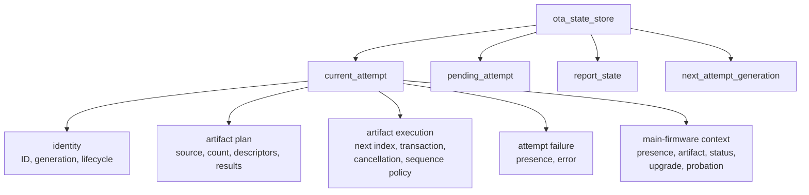
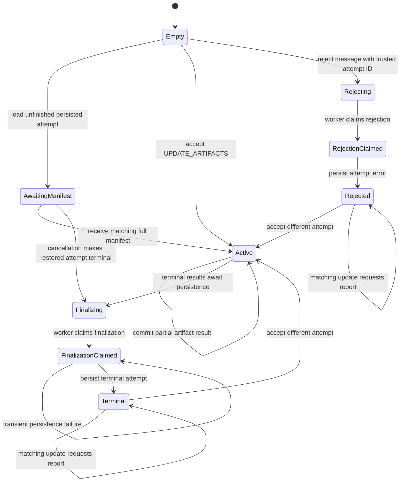
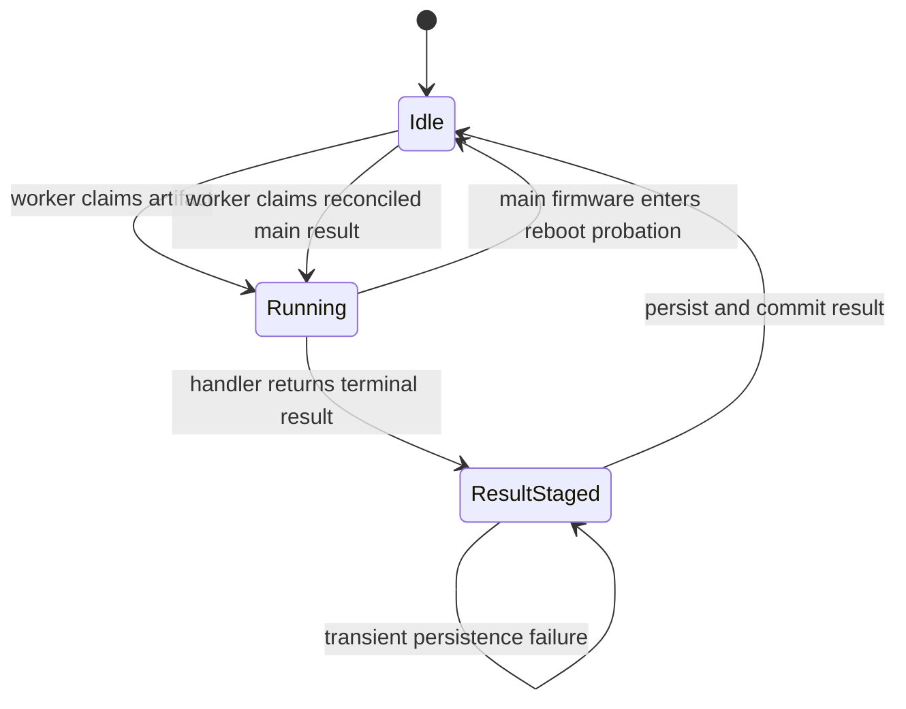
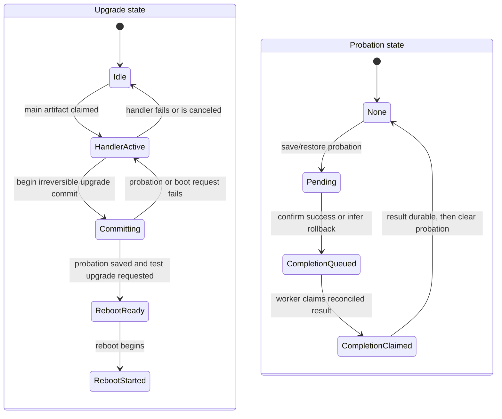
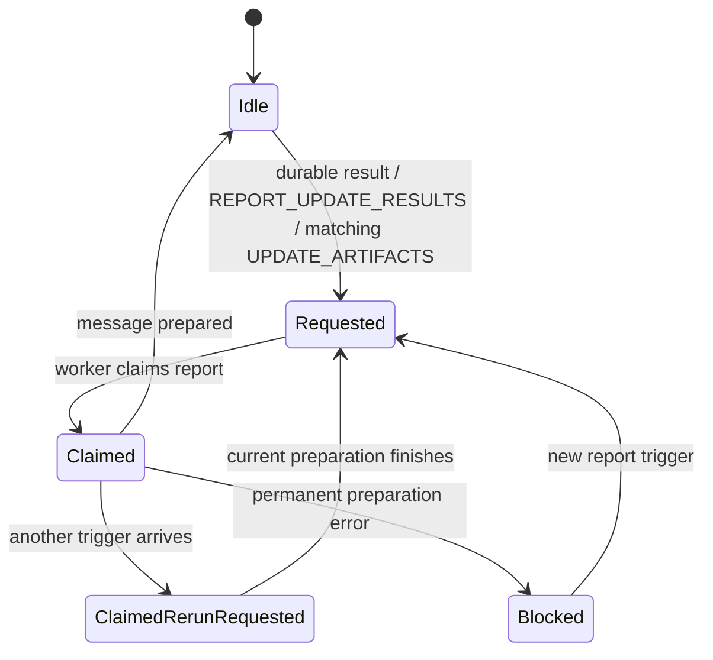
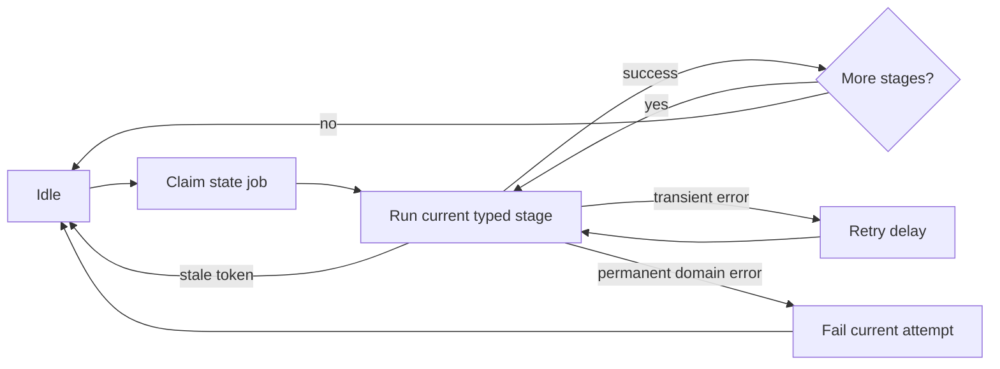
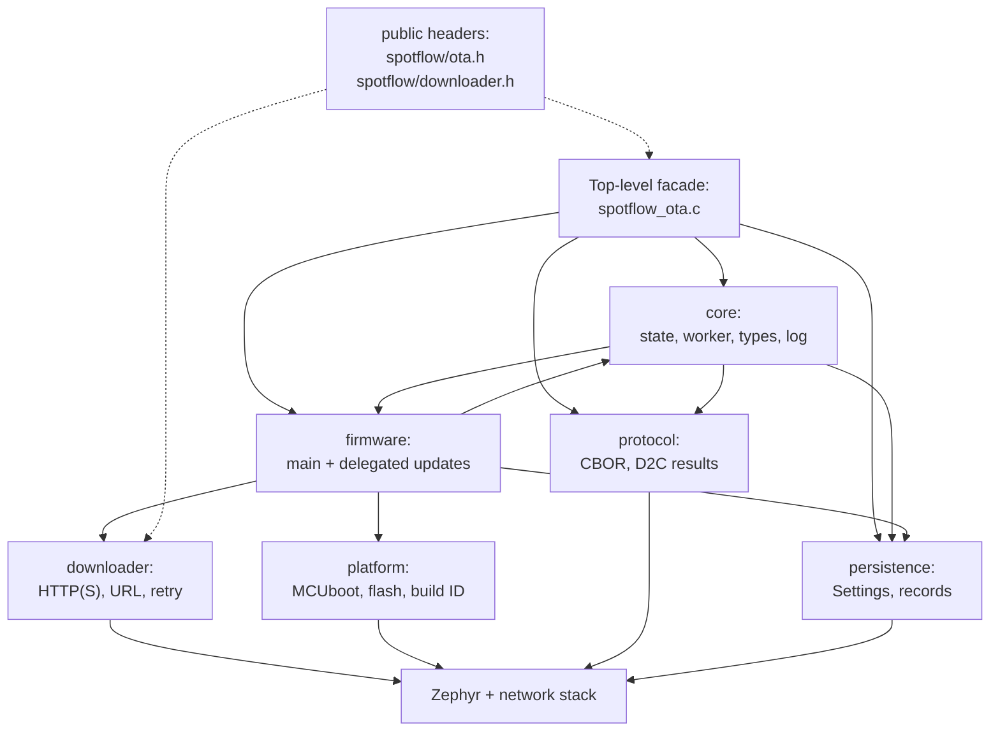
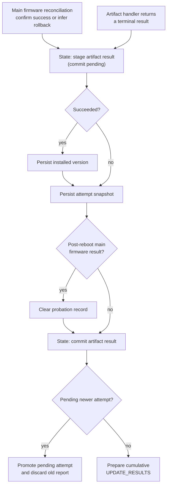

# Zephyr OTA updates— implementation design notes

This document summarizes important design decisions on the implementation of over-the-air updates.

## State-machine overview

OTA state is modeled as several coordinated state machines rather than one combined
state. All domain transitions are serialized by `state_mutex`; persistence, networking,
firmware handlers, callbacks, and platform operations run after the mutex is released.
The worker receives a job containing the attempt ID and an in-memory generation. Both
must still match when the worker stages or commits a result, which prevents a delayed job
from changing a replacement attempt even if an attempt ID is reused.

State commands return operation-specific dispositions rather than a shared set of boolean
flags. For example, an update result is exactly one of `STARTED`, `REHYDRATED`,
`DUPLICATE`, or `QUEUED`, while a cancellation result is exactly one of `NOT_CURRENT`,
`ACCEPTED`, or `IGNORED_LATE`. Orthogonal work outside the state lock is returned
separately as explicit effects: wake the worker, notify delegated firmware about a
cancellation, or cancel the automatic main-firmware download. The facade performs those
effects after the transition returns.

### In-memory state aggregate

The mutex-protected store separates attempt-owned state from scheduler-owned state:


```mermaid
flowchart TD
    store["ota_state_store"]
    current["current_attempt"]
    pending["pending_attempt"]
    report["report_state"]
    generation["next_attempt_generation"]
    identity["identity\nID, generation, lifecycle"]
    plan["artifact plan\nsource, count, descriptors, results"]
    execution["artifact execution\nnext index, transaction,\ncancellation, sequence policy"]
    failure["attempt failure\npresence, error"]
    main["main-firmware context\npresence, artifact, status,\nupgrade, probation"]

    store --> current
    store --> pending
    store --> report
    store --> generation
    current --> identity
    current --> plan
    current --> execution
    current --> failure
    current --> main
```

`pending_attempt` and `report_state` are deliberately not members of
`current_attempt`. They schedule replacement and report work for the store as a whole.
Starting or promoting an attempt resets the report scheduler, so a claimed report for an
old generation cannot become an obligation of the replacement attempt.

Each attempt substructure has an explicit validity rule:

| Context | When its fields are meaningful |
|---|---|
| `identity` | The ID and generation are nonzero whenever lifecycle is not `Empty`. |
| `artifact plan` | `source` states which other fields can be trusted; `results[0..count)` are valid for every source except `NONE`, while descriptors are valid only for `FULL_MANIFEST`. |
| `artifact execution` | `transaction.artifact_index` is valid only in `Running` or `ResultStaged`; `next_index` identifies the first pending result or equals `count`. |
| `attempt failure` | `error` is meaningful only when failure state is `PRESENT`. |
| `main-firmware context` | Artifact identity and index are meaningful only when presence is `PRESENT`; the reconciled result is meaningful only while probation completion is queued or claimed. |

The artifact plan source replaces ambiguous combinations such as “manifest unavailable,
but artifact count known”:

| Plan source | Count semantics | Descriptors | Typical origin |
|---|---|---|---|
| `NONE` | No artifact plan | Unavailable | Empty or whole-attempt rejection |
| `PROBATION_PREFIX` | Minimum known prefix ending at the main artifact | Main artifact identity comes from probation only | Probation exists but the attempt-results record does not |
| `PERSISTED_RESULTS` | Exact artifact count | Unavailable | Attempt results restored after reboot |
| `FULL_MANIFEST` | Exact artifact count | Available | `UPDATE_ARTIFACTS` received in this boot |

When a full manifest rehydrates a `PROBATION_PREFIX`, it may extend the prefix but cannot
contain fewer artifacts than the probation index requires. When it rehydrates
`PERSISTED_RESULTS`, its artifact count must match exactly. These checks make it explicit
that probation alone cannot reconstruct the full manifest.

### Attempt lifecycle


```mermaid
stateDiagram-v2
    [*] --> Empty
    Empty --> AwaitingManifest: load unfinished persisted attempt
    Empty --> Active: accept UPDATE_ARTIFACTS
    Empty --> Rejecting: reject message with trusted attempt ID

    AwaitingManifest --> Active: receive matching full manifest
    AwaitingManifest --> Finalizing: cancellation makes restored attempt terminal

    Active --> Active: commit partial artifact result
    Active --> Finalizing: terminal results await persistence
    Finalizing --> FinalizationClaimed: worker claims finalization
    FinalizationClaimed --> FinalizationClaimed: transient persistence failure
    FinalizationClaimed --> Terminal: persist terminal attempt

    Rejecting --> RejectionClaimed: worker claims rejection
    RejectionClaimed --> Rejected: persist attempt error

    Terminal --> Active: accept different attempt
    Rejected --> Active: accept different attempt
    Terminal --> Terminal: matching update requests report
    Rejected --> Rejected: matching update requests report
```

An unfinished current attempt has one tagged pending slot: `NONE`, `UPDATE`, or
`REJECTION`. A different attempt received while work is in progress fills that slot and
normally cancels the unfinished current work. Once the current attempt is durably
terminal, the report operation promotes the pending entry. Supersession after the main
upgrade commit boundary stores the pending entry but does not mutate the current attempt.

The full manifest is intentionally RAM-only. Loading an unfinished attempt therefore
enters `AwaitingManifest`; receiving the matching `UPDATE_ARTIFACTS` rehydrates its
artifact descriptors, requests a report for any durable results, and resumes remaining
artifacts.

### Artifact transaction


```mermaid
stateDiagram-v2
    [*] --> Idle
    Idle --> Running: worker claims artifact
    Running --> ResultStaged: handler returns terminal result
    Running --> Idle: main firmware enters reboot probation
    ResultStaged --> ResultStaged: transient persistence failure
    ResultStaged --> Idle: persist and commit result

    Idle --> Running: worker claims reconciled main result
```

Only one artifact transaction exists. It contains its artifact index, and every worker
transition validates the attempt ID, generation, and index. `ResultStaged` means the
in-memory result snapshot is protected from attempt replacement until it is persisted and
committed. A failure or cancellation also stages the cancellation of all remaining
artifacts as part of the same persisted attempt snapshot.

### Main-firmware upgrade and probation

The pre-reboot upgrade state and the cross-reboot probation state are orthogonal. This
avoids combinations of `upgrade_commit_started`, `reboot_started`, and
`probation_pending` booleans.


```mermaid
stateDiagram-v2
    state "Upgrade state" as upgrade {
        [*] --> Idle
        Idle --> HandlerActive: main artifact claimed
        HandlerActive --> Committing: begin irreversible upgrade commit
        Committing --> HandlerActive: probation or boot request fails
        Committing --> RebootReady: probation saved and test upgrade requested
        RebootReady --> RebootStarted: reboot begins
        HandlerActive --> Idle: handler fails or is canceled
    }

    state "Probation state" as probation {
        [*] --> None
        None --> Pending: save/restore probation
        Pending --> CompletionQueued: confirm success or infer rollback
        CompletionQueued --> CompletionClaimed: worker claims reconciled result
        CompletionClaimed --> None: result durable, then clear probation
    }
```

The externally visible phases (`PENDING_DOWNLOAD`, `DOWNLOADING`, `PENDING_UPGRADE`,
`PENDING_REBOOT`, and `UNCONFIRMED`) remain unchanged. Pause is an orthogonal flag valid
only in the documented pre-reboot phases. Cancellation and supersession are rejected once
the upgrade state reaches `Committing` because the persisted attempt must no longer
change across the irreversible boot transition.

### Report request and network outbox


```mermaid
stateDiagram-v2
    [*] --> Idle
    Idle --> Requested: durable result / REPORT_UPDATE_RESULTS / matching UPDATE_ARTIFACTS
    Blocked --> Requested: new report trigger
    Requested --> Claimed: worker claims report
    Claimed --> ClaimedRerunRequested: another trigger arrives
    Claimed --> Idle: message prepared
    Claimed --> Blocked: permanent preparation error
    ClaimedRerunRequested --> Requested: current preparation finishes
```

`Requested` is a coalescing obligation, not a delivery acknowledgment. The encoded
network outbox separately retains a message while the transport returns `-EAGAIN` and
drops it after a successful QoS 0 publish. A new `UPDATE_ARTIFACTS` for an attempt with
reportable results always requests another report, including after rehydration.

### Worker executor

The state selector returns one tagged job: rejection, artifact, reconciled main-firmware
completion, report, or terminal-attempt finalization. The job carries the current attempt
token plus only the payload valid for its kind. The worker then holds one corresponding
tagged operation; each union member has only its valid stage type, so there is no shared
stage enum that can represent, for example, an artifact operation in a report stage.

`spotflow_ota_state_get_worker_job()` is the only source of executable worker work. It
selects jobs in this order:

1. attempt rejection;
2. reconciled main-firmware completion;
3. required terminal-attempt finalization;
4. requested result report;
5. runnable artifact.

This order makes an undurable terminal attempt persist before a report for it is prepared.
Claiming finalization changes the lifecycle to `FinalizationClaimed`; a transient storage
failure retains that same job and token for retry. A durable `Terminal` attempt never
produces another finalization job merely because the worker is woken again.


```mermaid
flowchart LR
    idle[Idle] --> claim[Claim state job]
    claim --> stage[Run current typed stage]
    stage -->|success| next{More stages?}
    next -->|yes| stage
    next -->|no| idle
    stage -->|transient error| retry[Retry delay]
    retry --> stage
    stage -->|stale token| idle
    stage -->|permanent domain error| reject[Fail current attempt]
    reject --> idle
```

Artifact operations share the durable tail for delegated and main firmware:

```text
stage result → save installed version on success → persist attempt
             → clear probation when applicable → commit result → request report
```

## Module map

The repository [README](../../README.md#ota-updates) provides a high-level overview of the OTA implementation while the text below describes the individual folders and files.
The relevant source files are split by responsibility under `spotflow/zephyr/src/ota`:

| Folder | Responsibility |
|---|---|
| `.` | Public facade (`spotflow_ota.c` / `.h`), Kconfig, and OTA source list |
| `core/` | In-memory attempt/artifact state, worker orchestration, internal shared types, limits, logging |
| `protocol/` | OTA MQTT protocol encode/decode and pending D2C result publishing |
| `persistence/` | Zephyr Settings load/save and CBOR encoding of persisted records |
| `downloader/` | Public downloader API, URL parsing, HTTP transport, retry, pause/resume/cancel |
| `firmware/` | Automatic main-firmware lifecycle and delegated firmware callback dispatch |
| `platform/` | Zephyr/MCUboot/build-ID wrappers that are faked in tests |

Dependencies between folders:


```mermaid
flowchart TD
    facade["Top-level facade:\nspotflow_ota.c"]
    core["core:\nstate, worker, types, log"]
    protocol["protocol:\nCBOR, D2C results"]
    persistence["persistence:\nSettings, records"]
    downloader["downloader:\nHTTP(S), URL, retry"]
    firmware["firmware:\nmain + delegated updates"]
    platform["platform:\nMCUboot, flash, build ID"]
    public["public headers:\nspotflow/ota.h\nspotflow/downloader.h"]
    zephyr["Zephyr + network stack"]

    facade --> core
    facade --> protocol
    facade --> persistence
    facade --> firmware

    core --> protocol
    core --> persistence
    core --> firmware

    firmware --> downloader
    firmware --> platform
    firmware --> persistence
    firmware --> core

    downloader --> zephyr
    platform --> zephyr
    protocol --> zephyr
    persistence --> zephyr

    public -.-> facade
    public -.-> downloader
```

The diagram shows code dependencies, not thread ownership.
`core/spotflow_ota_worker.c` orchestrates most runtime work and intentionally calls into several folders; lower-level folders should avoid calling back into the facade.
The dotted lines show implementations of public headers.

Important files:

| Module | Responsibility |
|---|---|
| `spotflow_ota.c` | Public facade; delegates to internal modules; idempotent init |
| `core/spotflow_ota_state.c` | In-memory attempt/artifact state; mutex-protected transitions |
| `core/spotflow_ota_worker.c` | Dedicated worker thread; artifact sequencing and job dispatch |
| `protocol/spotflow_ota_cbor.c` | C2D decode / D2C encode; protocol limits and attempt errors |
| `protocol/spotflow_ota_net.c` | Pending D2C merge and MQTT publish wrapper |
| `persistence/spotflow_ota_persistence.c` | Zephyr Settings load/save for attempt, results, versions, probation |
| `persistence/spotflow_ota_records_cbor.c` | CBOR encoding of persisted records |
| `downloader/spotflow_ota_downloader.c` | Public downloader API; in-process HTTP Range retry loop; pause/resume/cancel |
| `downloader/spotflow_ota_downloader_transport_errors.c` | Transient download-error classification (`transient_failure` on transport attempts) |
| `downloader/spotflow_ota_downloader_transport_socket.c` | Socket/TLS HTTP transport for downloads |
| `platform/spotflow_ota_platform.c` | MCUboot confirm, test upgrade, reboot, flash slot access |
| `platform/spotflow_ota_identity.c` | Running and downloaded image build ID reads |
| `firmware/spotflow_ota_fw_main.c` | Automatic main firmware pre/post-reboot flow |
| `firmware/spotflow_ota_fw_custom.c` | Delegated firmware dispatch; weak default callbacks; cancel work item |

MQTT subscription and inbound routing live in `spotflow_mqtt.c` / `spotflow_processor.c`.
C2D payloads are decoded on the MQTT thread; all durable work is handed to the OTA worker.

## Initialization

OTA uses a **defensive initialization** model: `spotflow_ota_init()` is idempotent,
mutex-protected, and safe to call from more than one entry point.

**Primary path (Spotflow processor)**

1. `spotflow_mqtt_thread_entry()` calls `spotflow_ota_init()` once before the first
   session metadata publish. This loads Settings, restores in-memory state, starts the OTA
   worker, and (when automatic main-firmware handling is enabled) runs post-reboot
   reconciliation.
2. After MQTT connects, `spotflow_ota_init_session()` calls `spotflow_ota_init()` again
   (no-op if already initialized) and registers the OTA C2D subscription.

`spotflow_ota_init()` does not require MQTT to be connected.

**Defensive path (application / public API)**

Every public facade API in `spotflow/ota.h` that reads or changes OTA state calls
`spotflow_ota_init()` first.

User-implemented callbacks (`spotflow_on_handle_firmware_update`, and so on) are not
included; the SDK invokes those after init has already run.

This lets application and delegated-firmware code use the public API without calling
internal init functions, even if it runs before the MQTT session is established (for
example post-reboot confirmation in `main()`, or `spotflow_is_update_canceled()` inside a
download handler after reboot).

## Threading and synchronization

```
MQTT thread     → decode C2D, enqueue worker jobs, poll pending D2C send
OTA worker      → state transitions, artifact handlers, spotflow_download_artifact()
sysworkq        → spotflow_on_update_canceled()
App threads     → public API (pause/resume/fail/confirm/query)
```

`spotflow_download_artifact()` is synchronous: it blocks its caller until the download finishes, is canceled, or fails.
When the main firmware is handled automatically, its download always runs on the OTA worker thread.
When the user code implements a custom firmware handler, the download will run on the OTA worker thread, too, unless it is explicitly delegated to a different thread.

**Rules:**

- `state_mutex` protects in-memory attempt state only.
- No user callbacks, persistence, network, downloader, flash, or MQTT while holding
  `state_mutex`.
- Public API calls update state under the mutex, release it, then perform I/O or wake the
  worker.
- Main-firmware progress callbacks fire from the OTA worker after state changes, not from
  the calling application thread.

Cancellation uses `sysworkq` because the OTA worker may be blocked inside
`spotflow_on_handle_firmware_update()`. A work item calls `spotflow_on_update_canceled()`
without holding `state_mutex`.

## Attempt and artifact state model

**Attempts**

- One **current** attempt in RAM and persistence.
- One **pending newer** attempt in RAM only (not fully persisted as a second active
  attempt). Promoted when supersession is safe.

**Artifacts**

- Processed strictly in manifest order.
- Each artifact has a terminal result: `SUCCEEDED`, `FAILED`, or `CANCELED`, or is still
  in progress.

**Inbound message handling**

| Condition | Behavior |
|---|---|
| Duplicate same `updateAttemptId`, no artifact results yet | Ignored; processing continues |
| Duplicate same `updateAttemptId`, at least one artifact result (or whole-attempt error) | Manifest ignored; stored results re-sent; processing continues if the attempt is unfinished |
| New attempt while current is terminal | Accept and start |
| New attempt while current is unfinished | Stash one pending newer attempt; supersede the current one when safe (after finishing the current artifact or rebooting) |
| Malformed message, unable to parse attempt ID | Logged and ignored |
| Malformed message, able to parse attempt ID | Rejected with `updateAttemptError` |

**Supersession**

When a newer manifest arrives mid-attempt, the worker stops the current artifact when it
can do so safely (for example between download chunks or before starting the next
artifact). Terminal results for the superseded attempt are persisted locally but are **not**
reported to the cloud; processing continues with the promoted attempt.

A malformed `UPDATE_ARTIFACTS` message with a trustworthy but different attempt ID
follows the same supersession path: the rejection (`updateAttemptError`) is stored in the
single pending slot and reported only after the superseded attempt reaches terminal
results and is promoted. The superseded attempt's per-artifact results are not reported.

## Main firmware

**MCUboot requirements**

Automatic main-firmware handling (`CONFIG_SPOTFLOW_OTA_AUTO_HANDLE_MAIN_FIRMWARE`)
requires MCUboot in a **rollback-capable** mode, plus `CONFIG_FLASH`,
`CONFIG_FLASH_MAP`, and `CONFIG_STREAM_FLASH`. The worker requests
`BOOT_UPGRADE_TEST`, and post-reboot reconciliation infers failure when the running
build ID does not match the probation record (MCUboot reverted to the previous image).

**Pre-reboot (automatic handling)**

The OTA worker streams the image through the public downloader into the MCUboot secondary
slot, persists probation metadata, requests `BOOT_UPGRADE_TEST`, and reboots. Public
pause/resume/fail APIs apply only in this phase.

**Probation record**

Stored in Settings before requesting test upgrade. Contains enough context to correlate the
next boot with the attempt, artifact, slug, version, and expected build ID.

**Post-reboot reconciliation (`spotflow_ota_init`)**

| Running build ID vs probation | MCUboot confirmed | Outcome |
|---|---|---|
| Match | No | Phase `UNCONFIRMED`; wait for `spotflow_confirm_main_firmware_image()` |
| Match | Yes | Infer success; enqueue worker completion |
| Mismatch | — | Infer rollback/failed swap; enqueue failed worker completion |
| Unavailable | — | Enqueue failed worker completion |

The main artifact result stays **pending** until confirmation or rollback inference so
the cloud does not see success before the device has actually run the new image.

Post-reboot reconciliation does not persist attempt results or prepare an MQTT report
directly. It gives the worker a reconciled main-firmware result, which enters the same
durable completion pipeline as a result returned by a delegated artifact handler:


```mermaid
flowchart TD
    reconcile["Main firmware reconciliation\nconfirm success or infer rollback"]
    handler["Artifact handler returns\na terminal result"]
    stage["State: stage artifact result\n(commit pending)"]
    version{"Succeeded?"}
    saveVersion["Persist installed version"]
    saveAttempt["Persist attempt snapshot"]
    probation{"Post-reboot main\nfirmware result?"}
    clearProbation["Clear probation record"]
    commit["State: commit artifact result"]
    next{"Pending newer attempt?"}
    promote["Promote pending attempt\nand discard old report"]
    report["Prepare cumulative\nUPDATE_RESULTS"]

    reconcile --> stage
    handler --> stage
    stage --> version
    version -- yes --> saveVersion --> saveAttempt
    version -- no --> saveAttempt
    saveAttempt --> probation
    probation -- yes --> clearProbation --> commit
    probation -- no --> commit
    commit --> next
    next -- yes --> promote
    next -- no --> report
```

The worker owns installed-version persistence, attempt-result persistence, pending-attempt
promotion, and report preparation for both main and delegated firmware. The main-firmware
module owns only image handling, MCUboot operations, identity comparison, and probation
creation. Probation is cleared after the terminal result is durable; therefore a reset or
transient Settings failure before that point causes reconciliation to run again safely.

**Identity**

Build ID from Zephyr binary descriptors (`CONFIG_SPOTFLOW_GENERATE_BUILD_ID`) is used to compare running and downloaded images.
Downloaded-image read failure results into the failure of the update attempt.

## Persistence

Settings keys (namespace `spotflow/ota/`):

- **Attempt** - latest received attempt ID, terminal artifact results, actionable
  cancellation, whole-attempt errors.
- **Probation** - main firmware in-flight context across reboot.
- **Version / &lt;slug&gt;** - last installed version per firmware slug.

**Write ordering**

Terminal artifact results and attempt metadata are persisted **before** queueing D2C
reporting. Probation is written **before** requesting MCUboot test upgrade and is cleared
only **after** the reconciled main-artifact result has been persisted. The accepted attempt
is persisted by the worker before invoking any artifact handler, so the main-firmware
handler does not write the same unchanged attempt again immediately before reboot.

**Corruption**

Corrupt records loaded from Settings are ignored.

## Networking and results

- D2C publishes on `ota-cbor-d2c` at QoS **0**.
- The MQTT processing loop polls `spotflow_ota_net_send_pending_message()` alongside other
  outbound traffic.
- Multiple artifact results for the same attempt are **merged** into one pending D2C
  message before publish.
- If publish returns `-EAGAIN`, the pending message is retained and retried on the next
  poll.
- `REPORT_UPDATE_RESULTS` triggers re-send from persisted terminal state.
- A duplicate `UPDATE_ARTIFACTS` for the current attempt also triggers re-send when at
  least one artifact result (or a whole-attempt error) is already stored, because the
  cloud may resend the manifest until it receives results (for example after MQTT
  resubscribe or a lost QoS 0 `UPDATE_RESULTS` publish).

## Cancellation (implementation)

- **`UPDATE_ARTIFACTS` with `isCanceled: true` with an unseen attempt ID:** The attempt is accepted with
  `actionable_cancellation` set. All artifacts are marked `CANCELED` immediately; the
  worker is not started for firmware handlers. Terminal results are persisted and reported
  like any other finished attempt.
- **`CANCEL_UPDATE` or `UPDATE_ARTIFACTS` with `isCanceled: true` with the current attempt ID:**
  Cancellation is **accepted** only while no artifact has yet succeeded in the attempt.
- After acceptance, `spotflow_is_update_canceled()` is true until the running artifact
  returns a terminal result.
- If the running artifact later returns `SUCCEEDED`, that success is kept; cancellation
  is no longer actionable for remaining artifacts unless the handler itself was canceled.
- Late `CANCEL_UPDATE` after partial success is logged internally, not exposed through the
  public API.
- Cancellation and supersession stop mutating the current attempt after the main-firmware
  upgrade commit begins. At that point reboot is irreversible and the already-persisted
  attempt must remain unchanged; a newer manifest is processed after reboot when the cloud
  sends it again.

Delegated handlers should poll `spotflow_is_update_canceled()` and call
`spotflow_cancel_download()` when a download is active.

## Logging

All OTA modules use the `spotflow_ota` log module (`CONFIG_SPOTFLOW_MODULE_DEFAULT_LOG_LEVEL`).
Use **DBG** during manual E2E validation; use **INF** or higher in production.

**Never log:** full artifact URLs, OTA secrets, authorization headers, or raw CBOR payloads.

**INF (normal operation):** messages an integrator should see without debug logging enabled.

- Update attempt accepted, canceled, or rejected.
- Artifact processing started and finished (`succeeded`, `failed`, `canceled`), including slug
  and version.
- Main firmware lifecycle outcomes (rollback detected, update succeeded after confirmation).
- Installed-version skip before invoking a delegated handler.
- Main firmware phase transitions.

**DBG (diagnostics):** details useful when validating persistence, supersession, and
download plumbing.

- OTA init and loaded persistence (latest attempt, probation, last received attempt ID).
- Supersession and deferred promotion (pending attempt IDs, discarded superseded results).
- HTTP download start, resume offset, byte counts, and connection-lost resume hints
  (host/path are not logged).

**WRN / ERR:** transient download retries; decode, persistence, platform, and worker
failures. Include `attempt_id`, artifact slug, phase, or errno as appropriate.

## v1 non-goals

- Persisting download byte offset across reboot (in-process retries resume with HTTP
  Range; a new `spotflow_download_artifact()` call starts from byte zero).
- D2C QoS 1 (cloud uses `REPORT_UPDATE_RESULTS` for recovery).
- Public API for ignored/late cancellation diagnostics.
- Application-provided full-manifest handling (SDK owns manifest processing).
- Multiple historical attempts in persistence (only latest attempt is stored).

## Testing

Unit tests live under `spotflow/zephyr/tests/ota/` and run on `native_sim`:

```bash
west twister -T spotflow/zephyr/tests/ota -p native_sim --inline-logs
```

| Area | Test directory | Fakes |
|---|---|---|
| CBOR protocol | `cbor/` | — |
| State machine | `state/` | — |
| Persistence | `persistence/` | Settings test backend |
| D2C networking | `net/` | MQTT publish |
| Facade / MQTT routing | `facade/` | MQTT, worker |
| Worker orchestration | `worker/` | Worker idle promotion, deferred rejection, multi-artifact chain |
| MQTT / facade integration | `facade/` | C2D routing, version skip, cancel threading |
| Downloader | `downloader/` | Transport |
| Platform / identity | `platform/` | MCUboot, build ID |
| Main firmware | `fw_main/` | Downloader, platform, persistence, net |
