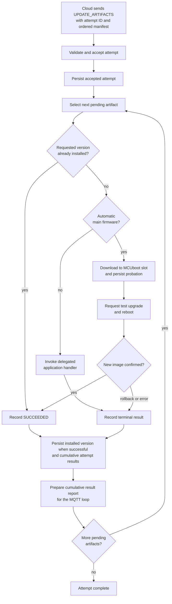
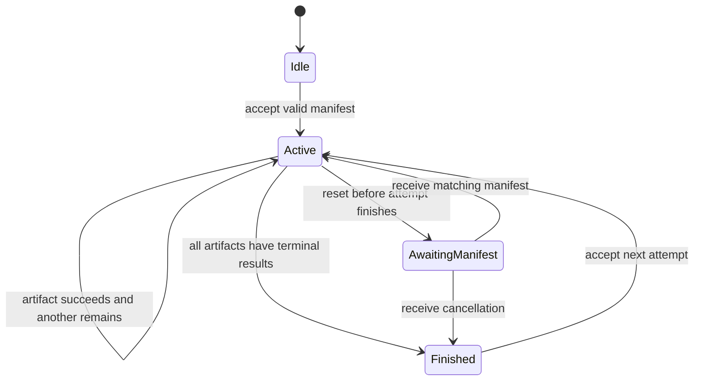
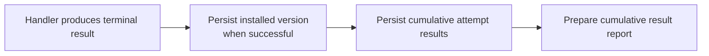
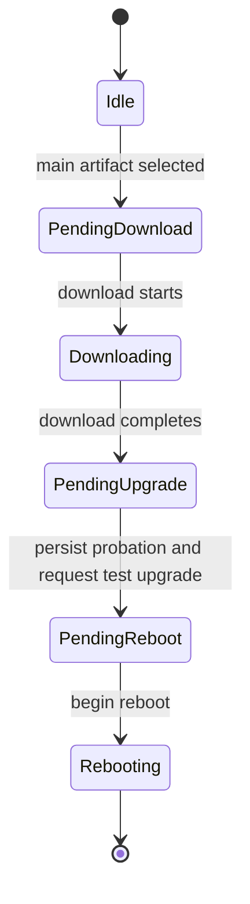
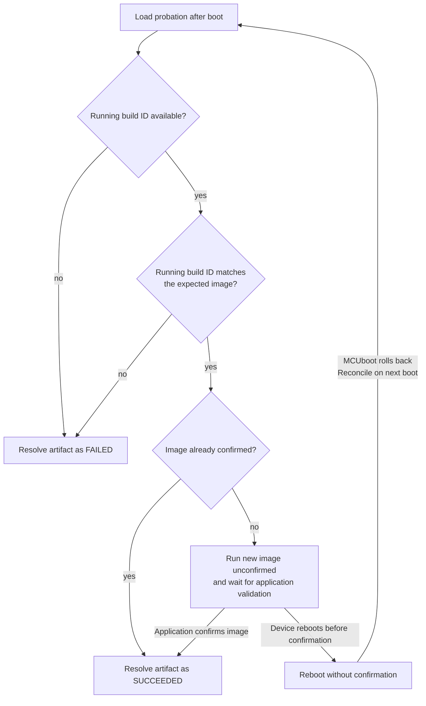
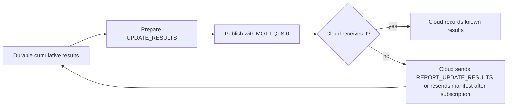
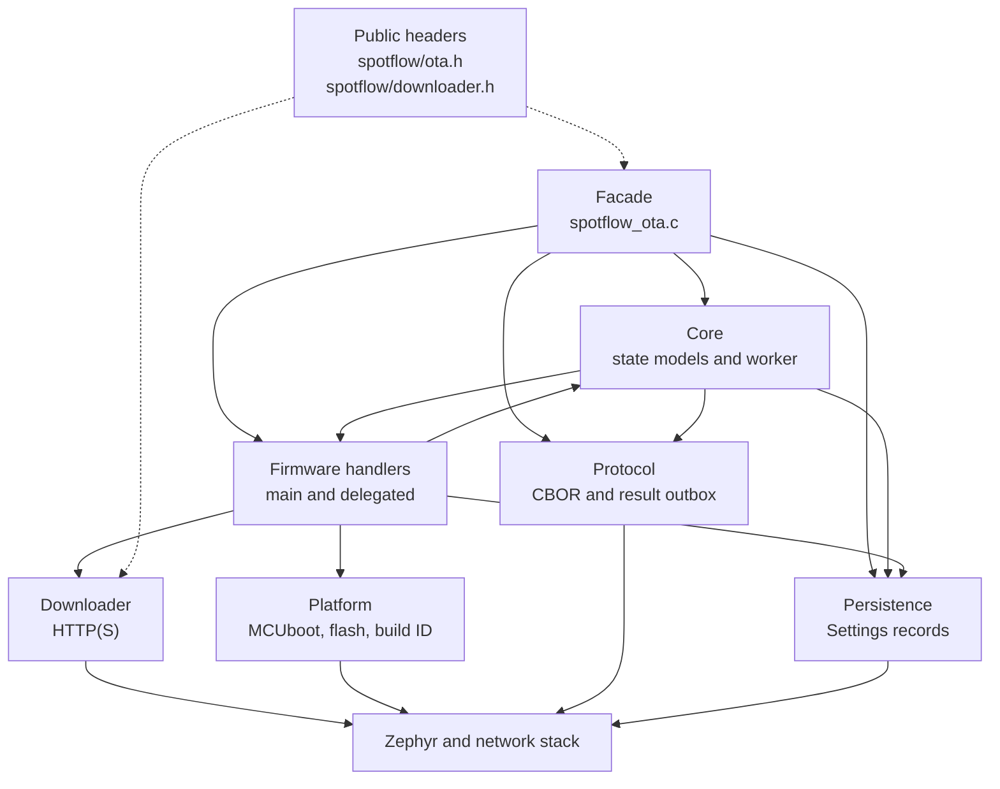
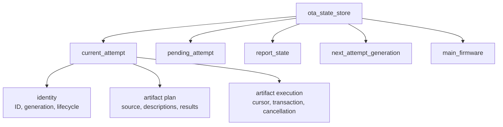
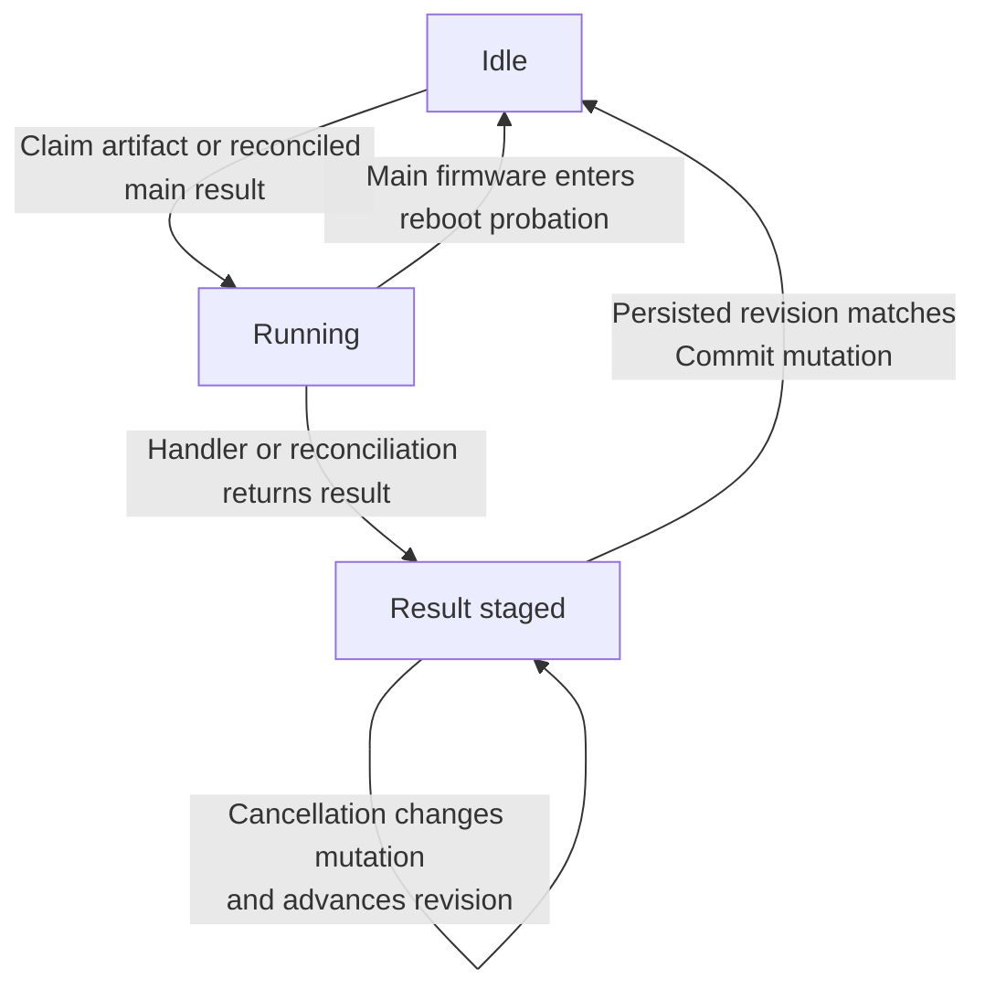
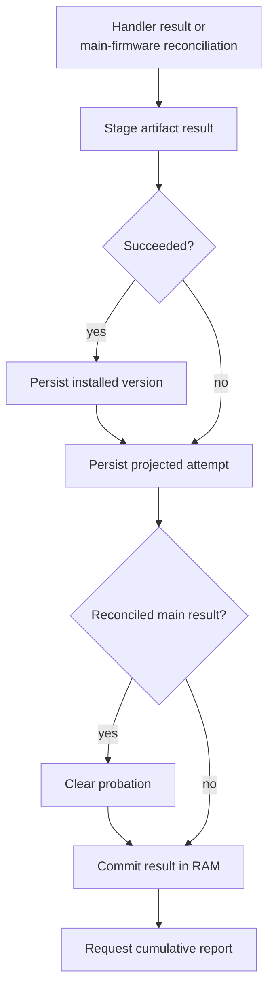

# Zephyr over-the-air (OTA) updates

This document explains the architecture and important design decisions behind these
updates in the Spotflow SDK for Zephyr.

## Scope and audience

This is a maintainer-facing document for contributors working on the SDK. It explains
how device-side updates behave, why the design uses its persistence and recovery rules,
and how those rules are implemented. Application developers integrating OTA updates
should start with the
[Zephyr guide for OTA updates](https://docs.spotflow.io/guides/zephyr/ota-zephyr) or the
[sample for OTA updates](../samples/ota).

The MQTT message schemas are documented in the
[MQTT protocol guide for OTA updates](https://docs.spotflow.io/guides/mqtt/ota-mqtt).
Knowing that protocol is not a prerequisite for reading this document: the behavioral
context and message names used by the implementation are introduced below.

## Overview

Spotflow creates an **update attempt** for a device when a deployment requires that
device to install one or more firmware versions. The cloud sends the attempt in an
`UPDATE_ARTIFACTS` message. The message contains an ordered **manifest** of
**artifacts**, where each artifact describes one firmware image, the version to install,
and how to download it.

The SDK accepts one current attempt, processes its artifacts in manifest order, persists
each terminal result, and sends cumulative results to the cloud. An artifact result is
terminal when it is `SUCCEEDED`, `FAILED`, or `CANCELED`. If an artifact does not
succeed, the SDK cancels all artifacts that have not started.

There are two firmware-handling paths:

- **Main firmware** is the firmware running the Spotflow SDK. With automatic handling
  enabled, the SDK downloads it into the MCUboot secondary slot, requests a test upgrade,
  reboots, and waits for the application to confirm the new image. Success is not
  recorded until the image is confirmed.
- **Delegated firmware** is installed by an application callback. Updating an external
  MCU is the usual example. Main firmware also uses this path when automatic handling is
  disabled.

The public API lets the application observe and control the automatic main-firmware path,
confirm a test image after reboot, handle delegated firmware, and respond to cancellation
requests that can still be handled safely. The SDK owns manifest processing, artifact
sequencing, persistence, and result reporting.

### Terminology

| Term | Meaning in this document |
|---|---|
| Deployment | Cloud-side rollout of selected firmware versions to a set of devices. |
| Update attempt | One device-specific request to perform a deployment, identified by a nonzero `updateAttemptId`. |
| Manifest | Ordered list of artifacts received for an attempt. |
| Artifact | One firmware image together with its slug, version, role, and download information. |
| Main firmware | Firmware that runs the Spotflow SDK on the primary MCU. |
| Delegated firmware | Firmware whose installation is performed by application code, commonly firmware for an external MCU. |
| Current attempt | The attempt whose durable results and execution state the SDK currently owns. |
| Pending attempt | One newer attempt retained in RAM during the exceptional supersession case, until it is safe to replace the current attempt. |
| Terminal result | `SUCCEEDED`, `FAILED`, or `CANCELED`; processing of that artifact is finished. |
| Durable state | State successfully stored through Zephyr Settings and recoverable after reset. |
| Rehydration | Restoring RAM-only artifact descriptions when the cloud resends a manifest matching an attempt loaded from persistence. |
| Probation | Persisted main-firmware context spanning an MCUboot test upgrade and reboot until success or rollback is resolved. |
| Actionable cancellation | A cancellation request received before the first artifact finishes and while the update can still be stopped safely. |
| Supersession | Exceptional replacement of an unfinished current attempt by a newer attempt. |
| C2D / D2C | Cloud-to-device requests and device-to-cloud results. |

### Basic workflow

The normal device-side flow is:



After each artifact result has been saved to persistent storage, the SDK prepares a
result message for publishing; it does not wait for the whole attempt to finish. The
message contains all results saved for that attempt so far.

The manifest itself is kept only in RAM. After a reset, the SDK restores the attempt ID
and known durable results, then waits for the cloud to resend the matching manifest.
That message rehydrates artifact descriptions and lets processing resume at the first
artifact without a durable terminal result.

The important exceptional flows are:

- **Reset:** restore durable attempt results and main-firmware probation, then rehydrate
  the manifest before resuming ordinary artifacts.
- **Lost result message:** result messages use MQTT QoS 0 and can therefore be lost.
  While the device remains connected, the cloud can request another cumulative report
  with `REPORT_UPDATE_RESULTS`. After the device reconnects and subscribes again, the
  cloud resends the manifest if it is still missing results. In either case, the SDK
  rebuilds the response from saved results; it does not rerun completed artifacts.
- **Cancellation:** when a cancellation is actionable, the SDK exposes it to the running
  handler or cancels the first artifact before it starts. Once that artifact finishes,
  either it succeeded and the remaining update must not be interrupted, or it
  failed/canceled and all remaining artifacts are already canceled.
- **Supersession:** the cloud normally waits for all artifact results before sending
  another attempt. Exceptionally, a newer attempt can arrive after the device's current
  deployment is removed and the device later takes part in another deployment. The SDK
  retains that attempt and stops the current one only at a safe boundary.

## Design

This section describes the device-side model and the reasons behind it. It deliberately
avoids source files, synchronization primitives, and internal transition APIs; those are
covered in [Implementation](#implementation).

### Attempt and artifact lifecycle

Only one attempt is processed at a time. Its artifacts are processed sequentially in
manifest order. Sequential processing provides deterministic results for multi-firmware
devices and avoids leaving later firmware updated when an earlier dependency failed.

The attempt remains active while at least one artifact has no terminal result. A
successful artifact advances processing to the next one. A failed or canceled artifact
makes the remaining pending artifacts `CANCELED`, which brings the whole attempt to a
terminal state without invoking their handlers.



An unfinished attempt restored after reset is `AwaitingManifest` because its artifact
descriptions, download URLs, and secrets are not persisted. The cloud normally resends
the manifest until it receives all results. The SDK can therefore reconstruct the
descriptions, keep the already durable results, and continue at the first pending
artifact.

Messages that cannot be decoded are ignored when no trustworthy attempt ID can be
extracted from them. When the ID is trustworthy, the SDK records and reports an
attempt-level rejection so the cloud does not wait indefinitely for artifact results
that the device cannot produce.

After a reboot or reconnection, subscribing to the update topic causes the cloud to
resend a manifest whose results are still incomplete. Such a duplicate does not restart
completed work. It rehydrates an unfinished attempt or triggers another result report
from saved results. During an uninterrupted connection, the cloud normally requests
another report with `REPORT_UPDATE_RESULTS` instead of repeating the manifest.

### Durable progress and power-loss recovery

The central persistence rule is that external effects must never get ahead of the
durable update state. In particular, the SDK must not report a result that it would
forget after an immediate reset.

For ordinary artifact completion, the ordering is:



Saving the installed version before the attempt result creates a deliberate recovery
path. If power is lost between those writes, the restored attempt still treats the
artifact as pending, but the installed-version check can recognize that installation
already succeeded and avoid invoking the handler again. Once the attempt result is
saved, it is authoritative after any subsequent reset.

The accepted attempt is persisted before its first handler runs. Consequently, a reset
during a handler restores an unfinished attempt rather than forgetting that the attempt
was ever received. The handler may be invoked again after manifest rehydration, so a
delegated handler that performs non-idempotent work must use its own device-specific
recovery mechanism.

The SDK stores only durable terminal results in reports. A result being saved cannot be
observed by reporting until the save completes. This preserves the same recovery rule
when cancellation or supersession arrives during result persistence.

### Main-firmware upgrade and probation

Automatic main-firmware updates cross a reboot, so their success cannot be decided by
the code that downloads the image. The SDK uses MCUboot test upgrades and a probation
record to transfer ownership of the update to the next boot.



The SDK persists the attempt, artifact identity, expected build ID, slug, and version in
the probation record before requesting the test upgrade. This order matters:

- If power is lost before probation is saved, the update remains an ordinary unfinished
  artifact and can resume after the manifest is rehydrated.
- If probation is saved but the test upgrade has not yet been requested, the next boot
  reconciles the record instead of blindly resuming the upgrade. The still-running old
  image will normally have a different build ID, which is recorded as `FAILED`. Success
  is possible only if the running image actually has the expected build ID and is
  already confirmed.
- Once the test upgrade is requested successfully, the SDK proceeds to reboot and
  MCUboot will select the new image. The request cannot be withdrawn, so cancellation
  and supersession can no longer alter the current attempt.

On the next boot, the SDK compares the running image with the expected build ID:



A matching but unconfirmed image is not reported as successful. The application must
first validate and explicitly confirm it through the public API. There is no separate
API for rejecting the image: leaving it unconfirmed and rebooting lets MCUboot roll
back. The following boot observes the build-ID mismatch and records failure.

The resolved artifact result is persisted before probation is cleared. If a reset occurs
first, the probation record causes reconciliation to run again. If a reset occurs after
the result is persisted but before probation is cleared, the durable result proves that
reconciliation already completed and the stale probation can be removed. Clearing
probation earlier would risk forgetting an update whose result was not yet durable.

### Security and trust boundaries

Firmware download and firmware authenticity are separate concerns. HTTPS protects the
download in transit, and the per-artifact OTA secret authorizes access to the image.
URLs and secrets are therefore sensitive and must not appear in logs.

For automatic main-firmware updates, MCUboot verifies the signed image before booting it.
Production devices must use an appropriate private signing key. The Spotflow build ID is
used only to correlate the downloaded, expected, and running images across reboot; it is
not a substitute for signature verification.

Persisted state is used only for the claims it can prove. A valid installed-version
record proves that the requested slug and version were installed, so the SDK can report
success without running the handler again. A saved terminal attempt result is likewise
authoritative. A probation record alone does not prove that a main-firmware upgrade
succeeded: the SDK must also identify the running image and, for the new image, observe
its confirmation. Invalid records are ignored, while missing or unusable
main-firmware identity is reported as failure rather than turning an uncertain upgrade
into success.

### Result delivery and recovery

The SDK normally prepares a report immediately after saving each artifact result. Each
such report contains all saved terminal results currently known for the attempt, not
only the newest one. This makes duplicate reports harmless and lets a later report fill
in for an earlier one that was lost.



QoS 0 keeps the device-side publishing path lightweight, but delivery is not
acknowledged. If the cloud detects a missing result while the connection continues, it
sends `REPORT_UPDATE_RESULTS`; the SDK then reconstructs a cumulative report from
persisted state. After a reboot or reconnection, the device subscribes again and the
cloud resends the manifest when results are still missing.

### Cancellation and exceptional supersession

Cancellation is intentionally conservative. It is actionable only before the first
artifact has finished and while that artifact can still be stopped safely. During that
window, a delegated handler can stop its work or cancel an active download. An
automatically handled main-firmware update can likewise be stopped while it is being
downloaded or prepared. Once the SDK has started the final sequence that saves
probation and requests the MCUboot test upgrade, cancellation is no longer applied.
This prevents cancellation from interleaving with a boot request that cannot be
withdrawn.

After the first artifact returns:

- `FAILED` or `CANCELED` already causes every remaining artifact to be canceled, so
  there is no additional work for a cancellation request to perform.
- `SUCCEEDED` is retained, and a later cancellation is ignored so that a partially
  completed multi-artifact update is not interrupted.

The cloud normally sends a new attempt only after receiving terminal results for the
current one. A newer attempt arriving while work is unfinished is therefore exceptional.
The SDK retains one such attempt in memory, stops the current attempt at the next safe
boundary, and then promotes the newer one. Results of the superseded attempt are kept
locally but are not reported because the cloud has already moved the device to the new
attempt.

### Serialized decisions and stale work

State-changing decisions are serialized: the SDK applies one decision completely before
applying another, so two concurrent calls cannot interleave partial state changes.
Persistence, networking, downloads, flash operations, and application callbacks run
outside these short decision steps. Slow or user-provided work therefore does not block
state queries and control calls.

The SDK starts at most one artifact operation at a time and associates it with the exact
attempt instance and artifact that caused it. Before applying an asynchronous
completion, the SDK checks that the same instance and artifact are still current.
Otherwise, the completion is discarded as stale. For example, an operation can start
for one instance of attempt ID 42, that state can later be reconstructed or replaced,
and a different instance can also have ID 42. A delayed completion from the first
instance must not change the second merely because their public attempt IDs match.

## Implementation

### Source layout

The implementation is split by responsibility under `spotflow/zephyr/src/ota`:

| Folder | Responsibility |
|---|---|
| `.` | Public facade (`spotflow_ota.c` / `.h`), Kconfig, and source list |
| `core/` | In-memory models, synchronized state coordinator, worker, shared types, and logging |
| `protocol/` | C2D decoding, D2C encoding, and pending result publishing |
| `persistence/` | Zephyr Settings records and their CBOR encoding |
| `downloader/` | Public downloader API, URL parsing, HTTP transport, retry, pause/resume/cancel |
| `firmware/` | Automatic main-firmware lifecycle and delegated callback dispatch |
| `platform/` | MCUboot, flash, reboot, and build-ID wrappers |



The diagram shows code dependencies, not execution contexts. The dotted lines connect
public declarations to their implementations.

Important entry points:

| File | Responsibility |
|---|---|
| `spotflow_ota.c` | Public facade and idempotent initialization |
| `core/spotflow_ota_state.c` | Synchronized aggregate state, effects, and job selection |
| `core/spotflow_ota_attempt_model.c` | Pure attempt, artifact, cancellation, and supersession transitions |
| `core/spotflow_ota_main_model.c` | Pure main-firmware execution, public-state projection, and probation transitions |
| `core/spotflow_ota_worker.c` | Durable artifact completion, report preparation, and job execution |
| `protocol/spotflow_ota_cbor.c` | C2D decoding and D2C encoding |
| `protocol/spotflow_ota_net.c` | Pending D2C result merge and MQTT publish wrapper |
| `persistence/spotflow_ota_persistence.c` | Settings load/save for attempts, versions, and probation |
| `firmware/spotflow_ota_fw_main.c` | Automatic main-firmware pre/post-reboot flow |
| `firmware/spotflow_ota_fw_custom.c` | Delegated firmware dispatch and cancellation callback |
| `downloader/spotflow_ota_downloader.c` | Synchronous download API and in-process HTTP Range retry |
| `platform/spotflow_ota_platform.c` | MCUboot, flash-slot, confirmation, and reboot operations |
| `platform/spotflow_ota_identity.c` | Running and downloaded image build-ID reads |

MQTT subscription and inbound routing live outside this directory in
`spotflow_mqtt.c` and `spotflow_processor.c`.

### Initialization

`spotflow_ota_init()` is idempotent and safe to reach through more than one entry point.
The MQTT thread calls it before the first session metadata publish. It loads persisted data from Zephyr Settings,
restores in-memory state, starts the update worker, and performs post-reboot
main-firmware reconciliation when automatic handling is enabled.

Every public facade API in `spotflow/ota.h` that reads or changes update state also calls
`spotflow_ota_init()` first. Application code can therefore confirm an unconfirmed image
or query cancellation before the MQTT session is established without calling an
internal initializer.

### Execution contexts

Runtime work is divided as follows:

```text
MQTT thread   → decode C2D, enqueue state work, poll pending D2C send
Update worker → persistence, artifact handlers, downloads, report preparation
sysworkq      → spotflow_on_update_canceled()
App threads   → public API (pause/resume/abort/confirm/query)
```

`spotflow_download_artifact()` is synchronous. Automatic main-firmware downloads and
delegated handlers therefore run on the update worker unless application code explicitly
delegates its own work to another thread.

Cancellation notification uses `sysworkq` because the update worker may be blocked
inside `spotflow_on_handle_firmware_update()`. The callback must not block unnecessarily
because it shares the system workqueue with unrelated work.

### State representation and synchronization

`state_mutex` protects the in-memory aggregate. No user callback, persistence, network,
downloader, flash, platform, or MQTT operation runs while it is held. State APIs make a
short transition, return any required external effects, and release the mutex before the
facade or worker performs those effects.



The attempt and main-firmware models are pure values: they receive state explicitly,
return typed transition outputs, and do not own a mutex or perform I/O. The coordinator
applies their outputs to the aggregate and handles rules that span both models.

An attempt ID alone is insufficient to identify in-memory work because an ID can be
restored or reused. Each accepted or restored attempt therefore receives a nonzero
generation. Worker jobs and operation tokens carry the attempt ID, generation, job kind,
and relevant artifact index. Every stage validates that identity before reading or
committing state; a mismatch produces a stale outcome.

Only one artifact transaction exists:



While a result is staged, the durable in-memory results remain unchanged. The
transaction instead owns a projected mutation. The worker captures and persists a copy
with that mutation overlaid, then commits it to the durable in-memory view only when the
saved revision still matches. If cancellation or supersession changes the mutation
during the save, its revision advances and the worker saves the newer projection without
invoking the handler again.

The state coordinator is the only source of worker jobs. Its priority is:

1. persist an attempt-level rejection;
2. complete post-reboot main-firmware reconciliation;
3. persist terminal results that are not owned by an artifact transaction;
4. prepare a requested result report;
5. process the next artifact.

This ordering ensures that results are durable before reporting and that a report is
prepared before another artifact adds more work. Report requests coalesce: a trigger
received during preparation records one rerun obligation rather than creating concurrent
report jobs.

### Persisted records

Settings keys use the namespace `spotflow/ota/`:

- **Attempt** — latest received attempt ID, artifact results, actionable cancellation,
  and whole-attempt errors.
- **Probation** — automatic main-firmware context that must cross a reboot.
- **Version / &lt;slug&gt;** — last installed version for each firmware slug.

The full manifest and a pending superseding attempt are RAM-only. Corrupt records are
ignored rather than trusted. The SDK never derives success from invalid persisted data;
an unusable main-firmware identity is resolved as failure when probation requires a
decision.

Important reset boundaries are:

| Last durable boundary | Restored behavior |
|---|---|
| No attempt record | Wait for `UPDATE_ARTIFACTS`. |
| Accepted attempt, no artifact result | Restore an unfinished attempt and wait for the matching manifest. |
| Installed version, no new attempt result | Rehydrate the manifest and recover success through the version check. |
| New attempt result | Treat that result as durable and continue at the first pending artifact after rehydration. |
| Terminal attempt, report not published | Rebuild the report when the manifest is repeated or `REPORT_UPDATE_RESULTS` arrives. |
| Probation, no durable reconciled result | Reconcile the running image again. |
| Durable reconciled result, probation still present | Keep the result and clear stale probation. |

### Message handling and result outbox

Inbound `UPDATE_ARTIFACTS` handling is:

| Condition | Behavior |
|---|---|
| Same attempt, no results | Ignore the duplicate and continue processing. |
| Same attempt, durable results exist | Ignore the duplicate manifest and request another cumulative report. |
| Different attempt, current attempt terminal | Replace the current attempt and start. |
| Different attempt, current attempt unfinished | Retain one pending attempt and supersede when safe. |
| Malformed message without trustworthy ID | Log and ignore it. |
| Malformed message with trustworthy ID | Persist and report `updateAttemptError`. |

D2C results are published on `ota-cbor-d2c` at QoS 0. The MQTT loop polls
`spotflow_ota_net_send_pending_message()` alongside other outbound traffic. The outbox
merges results for the same attempt. It retains the encoded message when publish returns
`-EAGAIN` and drops it after a successful publish call.

`REPORT_UPDATE_RESULTS` and a duplicate manifest request a fresh cumulative report from
the durable attempt view. A staged, not-yet-durable mutation is never included.

When a pending superseding attempt exists and the current attempt becomes terminal, the
report job promotes the pending attempt instead of preparing results for the superseded
one. `spotflow_ota_net_discard_pending()` removes any old outbound result before the new
attempt starts.

### Main-firmware implementation

Automatic handling (`CONFIG_SPOTFLOW_OTA_AUTO_HANDLE_MAIN_FIRMWARE`) requires MCUboot in
a rollback-capable mode, plus `CONFIG_FLASH`, `CONFIG_FLASH_MAP`, and
`CONFIG_STREAM_FLASH`. The build ID generated through Zephyr binary descriptors
(`CONFIG_SPOTFLOW_GENERATE_BUILD_ID`) identifies the running and downloaded images.
Failure to read the downloaded image identity fails the attempt.

Before reboot, `firmware/spotflow_ota_fw_main.c` streams the image through the downloader
into the MCUboot secondary slot, saves probation, requests `BOOT_UPGRADE_TEST`, and
reboots. The public abort control applies only before the SDK starts the final sequence
of saving probation and requesting the test upgrade. Pause/resume can postpone the
SDK-initiated reboot after the test upgrade is requested, but cannot undo that request
or prevent a reboot initiated elsewhere.

Initialization resolves probation as follows:

| Running build ID vs probation | MCUboot confirmed | Outcome |
|---|---|---|
| Match | No | Public phase `UNCONFIRMED`; wait for `spotflow_confirm_main_firmware_image()`. |
| Match | Yes | Queue `SUCCEEDED` reconciliation. |
| Mismatch | — | Queue `FAILED` reconciliation for rollback or failed swap. |
| Unavailable | — | Queue `FAILED` reconciliation. |

Reconciliation enters the same durable result pipeline as a delegated handler:



The result is already durable when probation is cleared. A reset before that point
repeats reconciliation; a reset afterward restores the result without repeating it.

### Cancellation and supersession implementation

An unseen `UPDATE_ARTIFACTS` message with `isCanceled: true` is accepted as an already
canceled attempt. All artifacts are marked `CANCELED`, no handler runs, and the terminal
results are persisted and reported.

For the current attempt, `CANCEL_UPDATE` and `UPDATE_ARTIFACTS` with `isCanceled: true`
are accepted only while no artifact has succeeded, the attempt is not already terminal,
and an automatic main-firmware update has not started the final probation-and-test-upgrade
sequence.

During actionable cancellation:

- `spotflow_is_update_canceled()` remains true until the running artifact returns;
- `spotflow_on_update_canceled()` runs on `sysworkq`;
- a result already being persisted keeps the handler outcome but is updated to cancel
  the remaining artifacts.

If the handler returns `SUCCEEDED`, that result is retained and the cancellation flag is
cleared so processing can continue. A late cancellation after success is logged but is
not exposed through the public API.

A different valid attempt or trustworthy rejection occupies the single pending slot.
Supersession marks unfinished results canceled when safe. After the current attempt
becomes terminal, pending promotion replaces its ID and generation, clears report
scheduling for the old instance, and wakes the worker for the replacement.

### Logging and sensitive data

All update modules use the `spotflow_ota` log module
(`CONFIG_SPOTFLOW_MODULE_DEFAULT_LOG_LEVEL`). Use `DBG` during manual end-to-end
validation and `INF` or higher in production.

Never log full artifact URLs, OTA secrets, authorization headers, or raw CBOR payloads.

- **DBG:** restored persistence, rehydration, supersession/promotion, retry offsets, and
  download byte counts.
- **INF:** accepted/canceled/rejected attempts, artifact start and terminal result, version
  skips, main-firmware phases, confirmation, and rollback.
- **WRN / ERR:** transient retry, decode, persistence, platform, and worker failures.
  Include attempt ID, artifact slug, phase, or errno where applicable.

### Current limitations

- Download byte offsets are not persisted across reboot. In-process retries use HTTP
  Range; a new `spotflow_download_artifact()` call starts at byte zero.
- D2C results use QoS 0; recovery uses cumulative durable results and cloud report
  requests.
- There is no public diagnostic API for ignored late cancellation.
- The SDK owns full-manifest processing; applications cannot replace it.
- Only the latest attempt is stored; historical attempts are not retained on the device.

### Testing

Unit tests live under `spotflow/zephyr/tests/ota/` and run on `native_sim`:

```bash
west twister -T spotflow/zephyr/tests/ota -p native_sim --inline-logs
```

| Area | Test directory | Main coverage or fakes |
|---|---|---|
| CBOR protocol | `cbor/` | Decode/encode and protocol limits |
| Attempt model | `attempt_model/` | Pure transitions, corrupted states, stale combinations |
| Main-firmware model | `main_model/` | Phases, controls, probation, projection |
| Aggregate state | `state/` | Ownership, job priority, report scheduling, supersession |
| Persistence | `persistence/` | Settings test backend and record recovery |
| D2C networking | `net/` | MQTT publish and pending-message merge |
| Facade and routing | `facade/` | C2D routing, public effects, cancellation threading |
| Worker | `worker/` | Durable ordering, retries, promotion, multi-artifact chains |
| Downloader | `downloader/` | Faked transport, retry, pause, resume, cancellation |
| Platform and identity | `platform/` | Faked MCUboot, flash, and build IDs |
| Main firmware | `fw_main/` | Downloader, platform, persistence, reconciliation |
