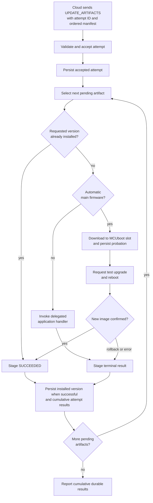
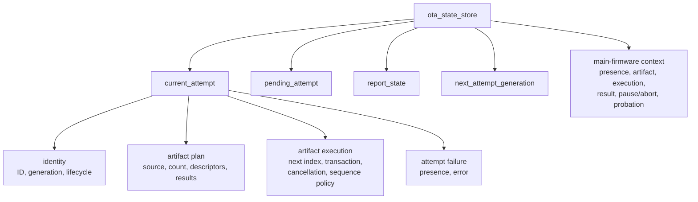
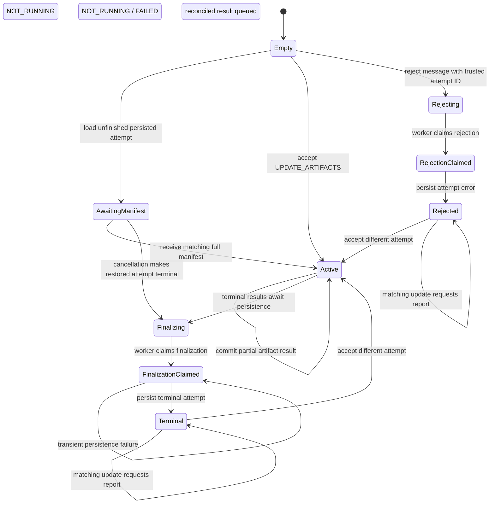
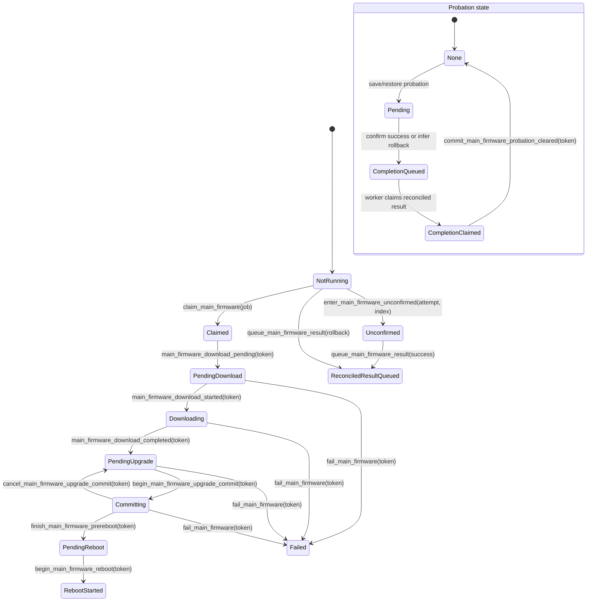
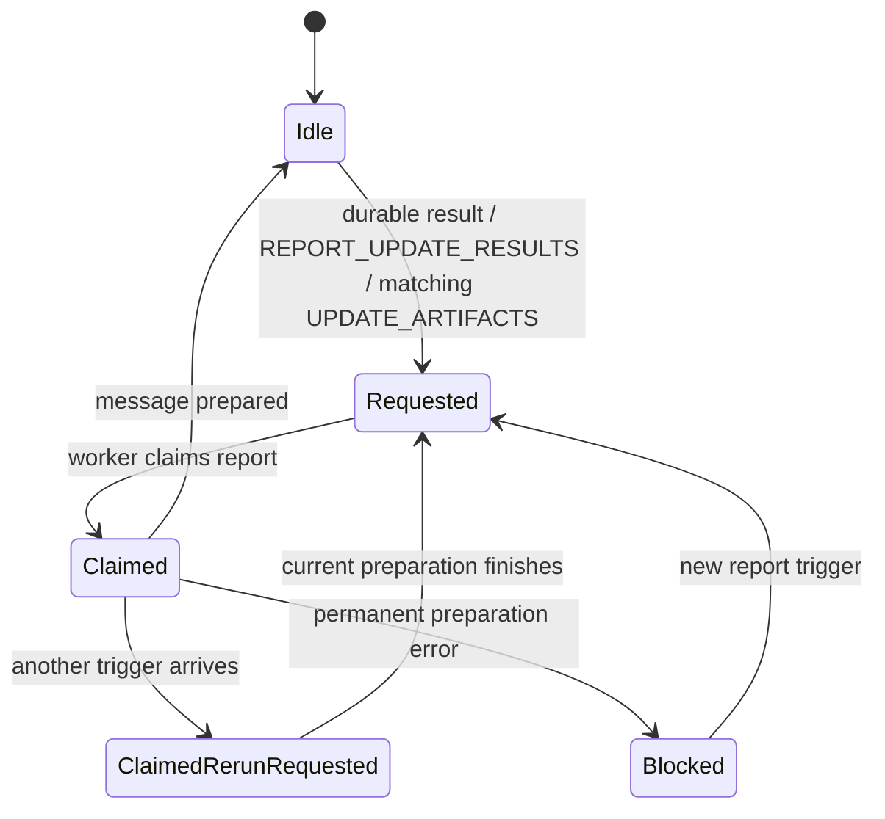
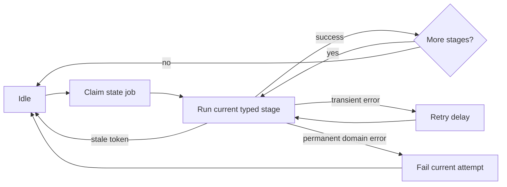
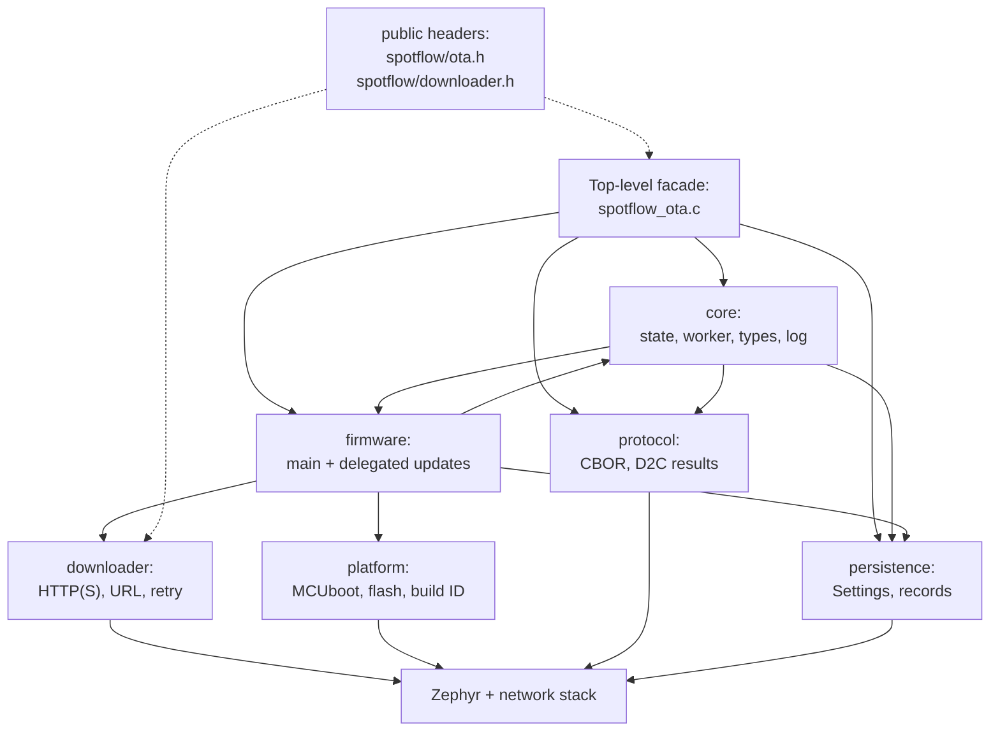
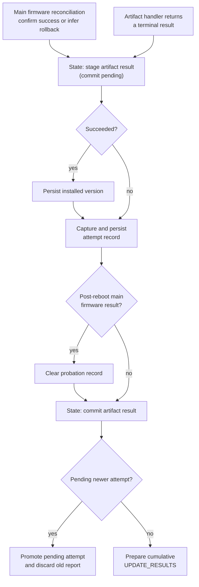

# Zephyr OTA updates — implementation design notes

This document explains the architecture and important design decisions behind
over-the-air (OTA) updates in the Spotflow SDK for Zephyr.

## Scope and audience

This is a maintainer-facing document for contributors working on the SDK. It explains
what the implementation must guarantee, why its state is structured as it is, and where
the relevant code and tests live. Application developers integrating OTA should start
with the [Zephyr OTA guide](https://docs.spotflow.io/guides/zephyr/ota-zephyr) or the
[OTA sample](../samples/ota).

The MQTT message schemas are documented in the
[OTA MQTT guide](https://docs.spotflow.io/guides/mqtt/ota-mqtt). Knowing that protocol is
not a prerequisite for reading this document: the behavioral context and message names
used by the implementation are introduced below.

## OTA mental model

Spotflow creates an **update attempt** for a device when a deployment requires that
device to install one or more firmware versions. The cloud sends the attempt in an
`UPDATE_ARTIFACTS` message. The message contains an ordered **manifest** of
**artifacts**, where each artifact describes one firmware image, the version to install,
and how to download it.

The SDK accepts one current attempt, processes its artifacts in manifest order, persists
each terminal result, and sends cumulative results to the cloud. An artifact result is
terminal when it is `SUCCEEDED`, `FAILED`, or `CANCELED`. If an artifact does not
succeed, the SDK cancels all artifacts that have not started.

There are two firmware-handling paths:

- **Main firmware** is the firmware running the Spotflow SDK. With automatic handling
  enabled, the SDK downloads it into the MCUboot secondary slot, requests a test upgrade,
  reboots, and waits for the application to confirm the new image. Success is not
  recorded until the image is confirmed.
- **Delegated firmware** is installed by application code through
  `spotflow_on_handle_firmware_update()`. Updating an external MCU is the usual example.
  Main firmware also uses this path when automatic handling is disabled.

The public API lets the application observe and control the automatic main-firmware path,
confirm a test image after reboot, handle delegated firmware, and respond to an
actionable cancellation. The SDK owns manifest processing, artifact sequencing,
persistence, and result reporting.

### Terminology

| Term | Meaning in this document |
|---|---|
| Deployment | Cloud-side rollout of selected firmware versions to a set of devices. |
| Update attempt | One device-specific request to perform a deployment, identified by a nonzero `updateAttemptId`. |
| Manifest | Ordered list of artifacts received for an attempt. |
| Artifact | One firmware image together with its slug, version, role, and download information. |
| Main firmware | Firmware that runs the Spotflow SDK on the primary MCU. |
| Delegated firmware | Firmware whose installation is performed by application code, commonly firmware for an external MCU. |
| Current attempt | The attempt whose durable results and execution state the SDK currently owns. |
| Pending attempt | One newer attempt retained in RAM until it is safe to replace the current attempt. |
| Terminal result | `SUCCEEDED`, `FAILED`, or `CANCELED`; the SDK will not run that artifact again for the same durable attempt state. |
| Durable state | State successfully stored through Zephyr Settings and recoverable after reset. |
| Staged result | A prospective terminal artifact result being persisted; it is not durable or reportable until committed. |
| Rehydration | Restoring RAM-only artifact descriptors when the cloud sends a manifest matching an attempt loaded from persistence. |
| Probation | Persisted main-firmware context spanning an MCUboot test upgrade and reboot until success or rollback is resolved. |
| Supersession | Replacement of an unfinished current attempt by a newer attempt. |
| Generation | An in-memory incarnation of an attempt, used with its ID to reject work claimed by older state. |
| Claim | A state transition that gives the worker exclusive ownership of a specific job and token. |
| C2D / D2C | Cloud-to-device requests and device-to-cloud results. |

## End-to-end behavior

The normal device-side flow is:



The manifest itself is kept only in RAM. After a reset, the SDK restores the attempt ID
and known durable results, then waits for the cloud to resend the matching manifest.
That message rehydrates artifact descriptors and lets processing resume at the first
artifact without a durable terminal result.

The important exceptional flows are:

- **Reset:** restore durable attempt/results and main-firmware probation; rehydrate the
  manifest before resuming ordinary artifacts.
- **Lost result message:** rebuild a cumulative result from durable state when the cloud
  sends `REPORT_UPDATE_RESULTS` or repeats the manifest.
- **Cancellation:** make cancellation actionable only while the first artifact is still
  running. Once it returns, either it succeeded and the remaining update must not be
  interrupted, or it failed/canceled and all remaining artifacts are already canceled.
- **Supersession:** retain one newer attempt and stop the current attempt only at a safe
  boundary; never let delayed work from the old attempt mutate the replacement.

## Architecture at a glance

| Area | Responsibility |
|---|---|
| Facade and public API | Initialize OTA defensively and translate public calls into state transitions and external effects. |
| Protocol and processor integration | Decode C2D OTA messages and prepare/publish D2C results. |
| Core state models | Represent attempts, artifact transactions, reporting, main-firmware execution, and probation without performing I/O. |
| Worker | Select and execute one typed job at a time, including persistence and reporting stages. |
| Firmware handlers | Perform automatic main-firmware updates or dispatch delegated updates to application callbacks. |
| Downloader | Download over HTTP(S), including in-process retry, pause, resume, and cancellation. |
| Persistence | Store the current attempt, terminal results, installed versions, and probation through Zephyr Settings. |
| Platform wrappers | Isolate MCUboot, flash, reboot, and build-ID operations and make them replaceable in tests. |

Runtime work is divided among the MQTT thread, one OTA worker, the Zephyr system
workqueue, and application threads. The state models decide transitions while holding
`state_mutex`, but callbacks, persistence, networking, downloads, flash operations, and
other external work always run after the mutex is released.

## Design goals and guarantees

| Quality | Intended guarantee | Main mechanism | Test evidence |
|---|---|---|---|
| Stale-work safety | Work claimed for an old attempt cannot mutate a replacement attempt. | Attempt ID, generation, artifact index, job kind, and operation-token validation. | `attempt_model/`, `state/`, `worker/` |
| Power-loss safety | Reportable results and cross-reboot main-firmware decisions are recoverable. | Persist-before-commit ordering and a separate probation record. | `persistence/`, `state/`, `fw_main/`, `worker/` |
| No premature success | The cloud does not see main-firmware success before the new image is running and confirmed. | MCUboot test upgrade, build-ID comparison, probation, and explicit confirmation. | `main_model/`, `fw_main/` |
| Concurrency safety | State transitions are serialized without running unbounded or external work under the state mutex. | Pure state models return explicit effects that the facade or worker performs after unlock. | `attempt_model/`, `main_model/`, `state/`, `facade/` |
| Result recovery | A lost QoS 0 result can be reconstructed without rerunning completed artifacts. | Cumulative durable results and cloud-driven report requests. | `net/`, `state/`, `worker/` |
| Deterministic sequencing | At most one artifact transaction runs and later artifacts do not run after a failure. | Ordered cursor, one owned transaction, and cancellation of the remaining plan. | `attempt_model/`, `worker/` |
| Testability | Domain transitions and platform-dependent operations can be checked independently. | Pure models plus wrappers/fakes for persistence, MQTT, downloader transport, flash, MCUboot, and identity. | All OTA model and integration suites |

These guarantees have deliberate boundaries:

- The SDK relies on MCUboot image validation and signing for main-firmware authenticity;
  production applications must use an appropriate private signing key.
- Artifact downloads use HTTPS with the SDK's TLS configuration and an OTA secret in the
  authorization header. URLs, secrets, headers, and raw payloads must not be logged.
- D2C delivery uses MQTT QoS 0. Eventual reporting therefore relies on the cloud repeating
  a manifest or sending `REPORT_UPDATE_RESULTS`.
- The SDK stores only the latest attempt and does not persist download byte offsets.
- Corrupt Settings records are ignored rather than trusted. Missing or unusable
  main-firmware identity is resolved as failure, never success.

The remainder of this document is a detailed implementation reference. Read the
[module map](#module-map) to find code, or continue with the state machines to understand
the exact ownership and recovery rules.

## Detailed state-machine reference

OTA state is modeled as several coordinated state machines rather than one combined
state. All domain transitions are serialized by `state_mutex`; persistence, networking,
firmware handlers, callbacks, and platform operations run after the mutex is released.
The worker receives a job containing the attempt ID and an in-memory generation. Both
must still match when the worker stages or commits a result, which prevents a delayed job
from changing a replacement attempt even if an attempt ID is reused.

State commands return operation-specific dispositions rather than a shared set of boolean
flags. For example, an update result is exactly one of `STARTED`, `REHYDRATED`,
`DUPLICATE`, or `QUEUED`, while a cancellation result is exactly one of `NOT_CURRENT`,
`ACCEPTED`, or `IGNORED_LATE`. Orthogonal work outside the state lock is returned
separately as explicit effects: wake the worker, notify delegated firmware about a
cancellation, or cancel the automatic main-firmware download. The facade performs those
effects after the transition returns.

### In-memory state aggregate

The mutex-protected store separates attempt-owned state from scheduler-owned state:



The attempt and main-firmware models are siblings. `pending_attempt` and
`report_state` are deliberately not members of `current_attempt`; they schedule
replacement and report work for the store as a whole.
Starting or promoting an attempt resets the report scheduler, so a claimed report for an
old generation cannot become an obligation of the replacement attempt.

Each attempt substructure has an explicit validity rule:

| Context | When its fields are meaningful |
|---|---|
| `identity` | The ID and generation are nonzero whenever lifecycle is not `Empty`. |
| `artifact plan` | `source` states which other fields can be trusted; `results[0..count)` are valid for every source except `NONE`, while descriptors are valid only for `FULL_MANIFEST`. |
| `artifact execution` | `transaction.artifact_index` is valid only in `Running` or `ResultStaged`; the mutation and its revision are valid only in `ResultStaged`; `next_index` identifies the first pending durable result or equals `count`. |
| `attempt failure` | `error` is meaningful only when failure state is `PRESENT`. |
| `main-firmware context` | Artifact identity and index are meaningful only when presence is `PRESENT`; execution determines the public phase, result is stored separately, and probation records cross-reboot and completion ownership. |

Debug invariants also check the relationships between these contexts. The cached attempt
lifecycle must agree with durable and projected terminality; the artifact cursor must be
the first durable pending result; running and staged transactions must own a pending
artifact; finalization claims require terminal durable results; a claimed report records
and matches the current generation; a pending replacement has a different nonzero
attempt ID; and main-firmware execution, result, pause/abort, and probation states must
form a legal model state. Public main-firmware state is projected from those fields, not
independently cached.

The artifact plan has a tagged source because the SDK can know different amounts of
manifest information after reboot. The tag determines whether the artifact count and
descriptors may be trusted:

| Plan source | Count semantics | Descriptors | Typical origin |
|---|---|---|---|
| `NONE` | No artifact plan | Unavailable | Empty or whole-attempt rejection |
| `PROBATION_PREFIX` | Minimum known prefix ending at the main artifact | Main artifact identity comes from probation only | Probation exists but the attempt-results record does not |
| `PERSISTED_RESULTS` | Exact artifact count | Unavailable | Attempt results restored after reboot |
| `FULL_MANIFEST` | Exact artifact count | Available | `UPDATE_ARTIFACTS` received in this boot |

When a full manifest rehydrates a `PROBATION_PREFIX`, it may extend the prefix but cannot
contain fewer artifacts than the probation index requires. When it rehydrates
`PERSISTED_RESULTS`, its artifact count must match exactly. These checks make it explicit
that probation alone cannot reconstruct the full manifest.

### Attempt lifecycle



An unfinished current attempt has one tagged pending slot: `NONE`, `UPDATE`, or
`REJECTION`. A different attempt received while work is in progress fills that slot and
normally cancels the unfinished current work. Once the current attempt is durably
terminal, the report operation promotes the pending entry. Supersession after the main
upgrade commit boundary stores the pending entry but does not mutate the current attempt.

The full manifest is intentionally RAM-only. Loading an unfinished attempt therefore
enters `AwaitingManifest`; receiving the matching `UPDATE_ARTIFACTS` rehydrates its
artifact descriptors, requests a report for any durable results, and resumes remaining
artifacts.

### Artifact transaction

```mermaid
stateDiagram-v2
    [*] --> Idle
    Idle --> Running: worker claims artifact
    Running --> ResultStaged: handler returns terminal result
    Running --> Idle: main firmware enters reboot probation
    ResultStaged --> ResultStaged: transient persistence failure / cancellation merge
    ResultStaged --> ResultStaged: revision changed; persist newer projection
    ResultStaged --> Idle: persisted revision matches; commit mutation

    Idle --> Running: worker claims reconciled main result
```



Only one artifact transaction exists. It contains its artifact index, and every worker
transition validates the attempt ID, generation, and index. The artifact plan's
`results[]` array is the authoritative durable in-memory view and remains unchanged in
`ResultStaged`. Instead, the transaction owns a mutation containing the prospective
result, whether remaining artifacts must be canceled, and whether the result came from a
handler or main-firmware reconciliation.

The worker does not read general state fields to build persistence records. It asks the
state module to capture either the durable attempt or the staged-result projection for
its claimed job. The state module validates the attempt ID, generation, job kind, and
transaction state and builds the record atomically under `state_mutex`.

For a staged result, the captured record is built from a projected copy: durable results
with the staged mutation overlaid. Commit applies the mutation to the durable array only
after that record has been saved. A report job cannot be claimed while a mutation is
staged, so reporting never interprets a projected result as already committed.

Each mutation has a revision. Cancellation or supersession arriving after staging keeps
the handler result, sets `cancel_remaining`, and advances the revision. If the revision
changes after the worker saves a projection but before state commit, the worker captures
and saves the newer projection before trying commit again. This closes the persistence-
to-commit race without invoking the artifact handler again. Main-firmware probation can
be resolved only for a mutation whose source is main reconciliation.

### Main-firmware upgrade and probation

Execution state, update result, and cross-reboot probation are stored separately. Each
value has one responsibility: execution records current ownership and progress, the
result records the last terminal outcome, and probation records work that must survive a
reboot. The public state is derived from their legal combinations.



The diagram labels name the state transition APIs. The execution enum records ownership,
progress, and the irreversible boundary. The update result remains a separate field;
completion returns execution to `Idle` and stores its outcome in that field.
`spotflow_ota_main_project_state()` is the sole mapping from execution, result, and the
orthogonal pause flag to public state; the public structure itself is never cached.
Every pre-reboot transition validates the claimed artifact job's attempt ID and
generation. Startup reconciliation instead validates the persisted probation attempt
and artifact index because reboot creates a new in-memory generation.

Pause is an orthogonal flag valid only in the documented pre-reboot phases. Cancellation
and supersession are rejected once the execution state reaches `Committing` because the
persisted attempt must no longer change across the irreversible boot transition.

### Report request and network outbox



`Requested` is a coalescing obligation, not a delivery acknowledgment. The encoded
network outbox separately retains a message while the transport returns `-EAGAIN` and
drops it after a successful QoS 0 publish. A new `UPDATE_ARTIFACTS` for an attempt with
reportable results always requests another report, including after rehydration.

### Worker executor

The state selector returns one tagged job: rejection, artifact, reconciled main-firmware
completion, report, or terminal-attempt finalization. The job carries the current attempt
token plus only the payload valid for its kind. The worker holds one corresponding
tagged operation whose union member contains only the stages and payload valid for that
job kind. Invalid combinations, such as an artifact operation in a report stage, cannot
be represented.

`spotflow_ota_state_get_worker_job()` is the only source of executable worker work. It
selects jobs in this order:

1. attempt rejection;
2. reconciled main-firmware completion;
3. required terminal-attempt finalization;
4. requested result report;
5. runnable artifact.

This order makes an undurable terminal attempt persist before a report for it is prepared.
Claiming finalization changes the lifecycle to `FinalizationClaimed`; a transient storage
failure retains that same job and token for retry. A durable `Terminal` attempt never
produces another finalization job merely because the worker is woken again.



Artifact operations share the durable tail for delegated and main firmware:

```text
stage mutation → save installed version on success → persist projected attempt
               → clear probation when applicable → validate mutation revision
               → commit mutation → request report
```

### Event/state coverage

The pure-model suites exercise allowed paths and deliberately corrupted cached states;
the state and worker suites cover token ownership, persistence, and aggregate scheduling.

| Model | Events covered | Rejected or stale combinations covered |
|---|---|---|
| Attempt | start, restore, rehydrate, duplicate/queue, cancel, supersede, promote, reject, finalize | lifecycle/terminality drift, invalid cursor or transaction ownership, stale generation, replacement with reused ID |
| Artifact transaction | claim, stage, project, revision change, persist, commit, advance | report during staging, mismatched revision/index/source, commit before persistence |
| Report | request, coalesce, claim, rerun, block, complete, promote pending | non-current attempt, stale job generation, report claim owned by another generation |
| Main execution/control | claim, download phases, pause/resume, abort, commit/cancel commit, prereboot, reboot, fail, public-state projection | illegal execution/probation/control combinations, pause or abort outside allowed states, stale handler token |
| Probation | restore, unconfirmed, success/rollback queue, completion claim, durable clear | wrong artifact identity, result-source mismatch, completion without owned artifact transaction |

## Module map

The repository [README](../../README.md#ota-updates) provides a high-level overview of the OTA implementation while the text below describes the individual folders and files.
The relevant source files are split by responsibility under `spotflow/zephyr/src/ota`:

| Folder | Responsibility |
|---|---|
| `.` | Public facade (`spotflow_ota.c` / `.h`), Kconfig, and OTA source list |
| `core/` | In-memory attempt/artifact state, worker orchestration, internal shared types, limits, logging |
| `protocol/` | OTA MQTT protocol encode/decode and pending D2C result publishing |
| `persistence/` | Zephyr Settings load/save and CBOR encoding of persisted records |
| `downloader/` | Public downloader API, URL parsing, HTTP transport, retry, pause/resume/cancel |
| `firmware/` | Automatic main-firmware lifecycle and delegated firmware callback dispatch |
| `platform/` | Zephyr/MCUboot/build-ID wrappers that are faked in tests |

Dependencies between folders:



The diagram shows code dependencies, not thread ownership.
`core/spotflow_ota_worker.c` orchestrates most runtime work and intentionally calls into several folders; lower-level folders should avoid calling back into the facade.
The dotted lines show implementations of public headers.

Important files:

| Module | Responsibility |
|---|---|
| `spotflow_ota.c` | Public facade; delegates to internal modules; idempotent init |
| `core/spotflow_ota_state.c` | Static aggregate store, mutex-protected API wrappers, report state, and aggregate job priority |
| `core/spotflow_ota_state_model.h` | Private in-memory representation; contains no global store or mutex |
| `core/spotflow_ota_attempt_model.c` | Pure attempt, plan, pending, cancellation, result-mutation, and lifecycle transitions |
| `core/spotflow_ota_main_model.c` | Pure canonical main execution, derived public-state projection, pause/abort, and probation transitions |
| `core/spotflow_ota_worker.c` | Dedicated worker thread; artifact sequencing and job dispatch |
| `protocol/spotflow_ota_cbor.c` | C2D decode / D2C encode; protocol limits and attempt errors |
| `protocol/spotflow_ota_net.c` | Pending D2C merge and MQTT publish wrapper |
| `persistence/spotflow_ota_persistence.c` | Zephyr Settings load/save for attempt, results, versions, probation |
| `persistence/spotflow_ota_records_cbor.c` | CBOR encoding of persisted records |
| `downloader/spotflow_ota_downloader.c` | Public downloader API; in-process HTTP Range retry loop; pause/resume/cancel |
| `downloader/spotflow_ota_downloader_transport_errors.c` | Transient download-error classification (`transient_failure` on transport attempts) |
| `downloader/spotflow_ota_downloader_transport_socket.c` | Socket/TLS HTTP transport for downloads |
| `platform/spotflow_ota_platform.c` | MCUboot confirm, test upgrade, reboot, flash slot access |
| `platform/spotflow_ota_identity.c` | Running and downloaded image build ID reads |
| `firmware/spotflow_ota_fw_main.c` | Automatic main firmware pre/post-reboot flow |
| `firmware/spotflow_ota_fw_custom.c` | Delegated firmware dispatch; weak default callbacks; cancel work item |

MQTT subscription and inbound routing live in `spotflow_mqtt.c` / `spotflow_processor.c`.
C2D payloads are decoded on the MQTT thread; all durable work is handed to the OTA worker.

The pure attempt and main-firmware models receive state explicitly and do not own a
mutex or reference the global store. The state coordinator applies their typed outputs
to the aggregate and selects jobs whose priority spans both models.

## Initialization

OTA uses a **defensive initialization** model: `spotflow_ota_init()` is idempotent,
mutex-protected, and safe to call from more than one entry point.

**Primary path (Spotflow processor)**

1. `spotflow_mqtt_thread_entry()` calls `spotflow_ota_init()` once before the first
   session metadata publish. This loads Settings, restores in-memory state, starts the OTA
   worker, and (when automatic main-firmware handling is enabled) runs post-reboot
   reconciliation.
2. After MQTT connects, `spotflow_ota_init_session()` calls `spotflow_ota_init()` again
   (no-op if already initialized) and registers the OTA C2D subscription.

`spotflow_ota_init()` does not require MQTT to be connected.

**Defensive path (application / public API)**

Every public facade API in `spotflow/ota.h` that reads or changes OTA state calls
`spotflow_ota_init()` first.

User-implemented callbacks (`spotflow_on_handle_firmware_update`, and so on) are not
included; the SDK invokes those after init has already run.

This lets application and delegated-firmware code use the public API without calling
internal init functions, even if it runs before the MQTT session is established (for
example post-reboot confirmation in `main()`, or `spotflow_is_update_canceled()` inside a
download handler after reboot).

## Threading and synchronization

```
MQTT thread     → decode C2D, enqueue worker jobs, poll pending D2C send
OTA worker      → state transitions, artifact handlers, spotflow_download_artifact()
sysworkq        → spotflow_on_update_canceled()
App threads     → public API (pause/resume/fail/confirm/query)
```

`spotflow_download_artifact()` is synchronous: it blocks its caller until the download finishes, is canceled, or fails.
When the main firmware is handled automatically, its download always runs on the OTA worker thread.
When application code implements a delegated firmware handler, the download also runs on
the OTA worker thread unless the application explicitly delegates it to another thread.

**Rules:**

- `state_mutex` protects in-memory attempt state only.
- No user callbacks, persistence, network, downloader, flash, or MQTT while holding
  `state_mutex`.
- Public API calls update state under the mutex, release it, then perform I/O or wake the
  worker.
- Main-firmware progress callbacks fire from the OTA worker after state changes, not from
  the calling application thread.

Cancellation uses `sysworkq` because the OTA worker may be blocked inside
`spotflow_on_handle_firmware_update()`. A work item calls `spotflow_on_update_canceled()`
without holding `state_mutex`.

## Attempt intake and supersession

**Attempts**

- One **current** attempt in RAM and persistence.
- One **pending newer** attempt in RAM only (not fully persisted as a second active
  attempt). Promoted when supersession is safe.

**Artifacts**

- Processed strictly in manifest order.
- Each artifact has a terminal result: `SUCCEEDED`, `FAILED`, or `CANCELED`, or is still
  in progress.

**Inbound message handling**

| Condition | Behavior |
|---|---|
| Duplicate same `updateAttemptId`, no artifact results yet | Ignored; processing continues |
| Duplicate same `updateAttemptId`, at least one artifact result (or whole-attempt error) | Manifest ignored; stored results re-sent; processing continues if the attempt is unfinished |
| New attempt while current is terminal | Accept and start |
| New attempt while current is unfinished | Stash one pending newer attempt; supersede the current one when safe (after finishing the current artifact or rebooting) |
| Malformed message, unable to parse attempt ID | Logged and ignored |
| Malformed message, able to parse attempt ID | Rejected with `updateAttemptError` |

**Supersession**

When a newer manifest arrives mid-attempt, the worker stops the current artifact when it
can do so safely (for example between download chunks or before starting the next
artifact). Terminal results for the superseded attempt are persisted locally but are **not**
reported to the cloud; processing continues with the promoted attempt.

A malformed `UPDATE_ARTIFACTS` message with a trustworthy but different attempt ID
follows the same supersession path: the rejection (`updateAttemptError`) is stored in the
single pending slot and reported only after the superseded attempt reaches terminal
results and is promoted. The superseded attempt's per-artifact results are not reported.

## Main-firmware lifecycle and recovery

**MCUboot requirements**

Automatic main-firmware handling (`CONFIG_SPOTFLOW_OTA_AUTO_HANDLE_MAIN_FIRMWARE`)
requires MCUboot in a **rollback-capable** mode, plus `CONFIG_FLASH`,
`CONFIG_FLASH_MAP`, and `CONFIG_STREAM_FLASH`. The worker requests
`BOOT_UPGRADE_TEST`, and post-reboot reconciliation infers failure when the running
build ID does not match the probation record (MCUboot reverted to the previous image).

**Pre-reboot (automatic handling)**

The OTA worker streams the image through the public downloader into the MCUboot secondary
slot, persists probation metadata, requests `BOOT_UPGRADE_TEST`, and reboots. Public
pause/resume/fail APIs apply only in this phase.

**Probation record**

Stored in Settings before requesting test upgrade. Contains enough context to correlate the
next boot with the attempt, artifact, slug, version, and expected build ID.

**Post-reboot reconciliation (`spotflow_ota_init`)**

| Running build ID vs probation | MCUboot confirmed | Outcome |
|---|---|---|
| Match | No | Phase `UNCONFIRMED`; wait for `spotflow_confirm_main_firmware_image()` |
| Match | Yes | Infer success; enqueue worker completion |
| Mismatch | — | Infer rollback/failed swap; enqueue failed worker completion |
| Unavailable | — | Enqueue failed worker completion |

The main artifact result stays **pending** until confirmation or rollback inference so
the cloud does not see success before the device has actually run the new image.

Post-reboot reconciliation does not persist attempt results or prepare an MQTT report
directly. It gives the worker a reconciled main-firmware result, which enters the same
durable completion pipeline as a result returned by a delegated artifact handler:



The worker owns installed-version persistence, attempt-result persistence, pending-attempt
promotion, and report preparation for both main and delegated firmware. The main-firmware
module owns only image handling, MCUboot operations, identity comparison, and probation
creation. Probation is cleared after the terminal result is durable; therefore a reset or
transient Settings failure before that point causes reconciliation to run again safely.

Production orchestration uses purpose-specific state queries for persistence capture,
report and promotion planning, operation-token validation, and the main-firmware public
status. A broader read-only projection is reserved for tests and diagnostics; production
transitions do not use it as a second source of state.

**Identity**

Build ID from Zephyr binary descriptors (`CONFIG_SPOTFLOW_GENERATE_BUILD_ID`) is used to compare running and downloaded images.
Failure to read the downloaded image identity causes the update attempt to fail.

## Persistence

Settings keys (namespace `spotflow/ota/`):

- **Attempt** - latest received attempt ID, terminal artifact results, actionable
  cancellation, whole-attempt errors.
- **Probation** - main firmware in-flight context across reboot.
- **Version / &lt;slug&gt;** - last installed version per firmware slug.

**Write ordering**

Terminal artifact results and attempt metadata are persisted **before** queueing D2C
reporting. Probation is written **before** requesting MCUboot test upgrade and is cleared
only **after** the reconciled main-artifact result has been persisted. The accepted attempt
is persisted by the worker before invoking any artifact handler.

**Power-loss boundaries**

| Last durable boundary before reset | Reconstructed state and next action |
|---|---|
| No attempt record | No current attempt; wait for `UPDATE_ARTIFACTS`. |
| Accepted attempt saved, no artifact result saved | Restore `AwaitingManifest`; a matching manifest restores descriptors and resumes the pending artifact. |
| Installed version saved, staged attempt projection not saved | Restore the older attempt result; after manifest rehydration the installed-version check can recover the successful artifact without invoking its handler again. |
| Staged attempt projection saved, in-memory mutation not committed | Restore the saved result as durable and continue from the first pending artifact after manifest rehydration. |
| Terminal attempt/finalization record saved, report not prepared or published | Restore `Terminal`/`Rejected`; duplicate manifest or `REPORT_UPDATE_RESULTS` requests another cumulative report. |
| Probation saved, MCUboot test upgrade not yet requested | Startup reconciliation sees probation and resolves the running image conservatively. |
| MCUboot test upgrade requested, reboot occurs | Probation correlates the next boot; confirmation queues success and rollback/mismatch queues failure. |
| Reconciled main result saved, probation not cleared | The main result restores as durable; startup identifies the probation record as stale and clears it without queueing completion again. |
| Probation cleared, in-memory result not committed | The saved attempt record already contains the result; restore treats it as durable. |
| D2C result prepared but QoS 0 publish not observed | The cloud can issue `REPORT_UPDATE_RESULTS`; the device rebuilds the current attempt’s report from its durable view. |

**Corruption**

Corrupt records loaded from Settings are ignored rather than trusted. The SDK never
derives a successful artifact or main-firmware result from an invalid record. It waits
for the cloud to provide usable attempt context again, or resolves unusable
main-firmware identity as failure when probation requires a decision.

## Networking and results

- D2C publishes on `ota-cbor-d2c` at QoS **0**.
- The MQTT processing loop polls `spotflow_ota_net_send_pending_message()` alongside other
  outbound traffic.
- Multiple artifact results for the same attempt are **merged** into one pending D2C
  message before publish.
- If publish returns `-EAGAIN`, the pending message is retained and retried on the next
  poll.
- `REPORT_UPDATE_RESULTS` for the current attempt triggers re-send from its durable
  persisted view. Known partial results may be reported; a staged mutation is never
  presented as durable.
- A duplicate `UPDATE_ARTIFACTS` for the current attempt also triggers re-send when at
  least one artifact result (or a whole-attempt error) is already stored, because the
  cloud may resend the manifest until it receives results (for example after MQTT
  resubscribe or a lost QoS 0 `UPDATE_RESULTS` publish).

## Cancellation (implementation)

- **`UPDATE_ARTIFACTS` with `isCanceled: true` with an unseen attempt ID:** The attempt is accepted with
  `actionable_cancellation` set. All artifacts are marked `CANCELED` immediately; the
  worker is not started for firmware handlers. Terminal results are persisted and reported
  like any other finished attempt.
- **`CANCEL_UPDATE` or `UPDATE_ARTIFACTS` with `isCanceled: true` with the current attempt ID:**
  Cancellation is actionable only while processing the first artifact has not finished.
- During that window, `spotflow_is_update_canceled()` is true and
  `spotflow_on_update_canceled()` is invoked so that a delegated handler can stop safely.
- Once the first artifact returns, there is no useful attempt-wide cancellation left to
  perform:
  - if it returns `FAILED` or `CANCELED`, the SDK already cancels every remaining
    artifact;
  - if it returns `SUCCEEDED`, the SDK keeps that success and deliberately ignores a
    later cancellation so that it does not interrupt the remaining update.
- A late cancellation is logged internally and is not exposed through the public API.
- Cancellation and supersession stop mutating the current attempt after the main-firmware
  upgrade commit begins. At that point reboot is irreversible and the already-persisted
  attempt must remain unchanged; a newer manifest is processed after reboot when the cloud
  sends it again.

Delegated handlers should poll `spotflow_is_update_canceled()` and call
`spotflow_cancel_download()` when a download is active.

## Logging

All OTA modules use the `spotflow_ota` log module (`CONFIG_SPOTFLOW_MODULE_DEFAULT_LOG_LEVEL`).
Use **DBG** during manual E2E validation; use **INF** or higher in production.

**Never log:** full artifact URLs, OTA secrets, authorization headers, or raw CBOR payloads.

**INF (normal operation):** messages an integrator should see without debug logging enabled.

- Update attempt accepted, canceled, or rejected.
- Artifact processing started and finished (`succeeded`, `failed`, `canceled`), including slug
  and version.
- Main firmware lifecycle outcomes (rollback detected, update succeeded after confirmation).
- Installed-version skip before invoking a delegated handler.
- Main firmware phase transitions.

**DBG (diagnostics):** details useful when validating persistence, supersession, and
download plumbing.

- OTA init and loaded persistence (latest attempt, probation, last received attempt ID).
- Supersession and deferred promotion (pending attempt IDs, discarded superseded results).
- HTTP download start, resume offset, byte counts, and connection-lost resume hints
  (host/path are not logged).

**WRN / ERR:** transient download retries; decode, persistence, platform, and worker
failures. Include `attempt_id`, artifact slug, phase, or errno as appropriate.

## v1 non-goals

- Persisting download byte offset across reboot (in-process retries resume with HTTP
  Range; a new `spotflow_download_artifact()` call starts from byte zero).
- D2C QoS 1 (cloud uses `REPORT_UPDATE_RESULTS` for recovery).
- Public API for ignored/late cancellation diagnostics.
- Application-provided full-manifest handling (SDK owns manifest processing).
- Multiple historical attempts in persistence (only latest attempt is stored).

## Testing

Unit tests live under `spotflow/zephyr/tests/ota/` and run on `native_sim`:

```bash
west twister -T spotflow/zephyr/tests/ota -p native_sim --inline-logs
```

| Area | Test directory | Fakes |
|---|---|---|
| CBOR protocol | `cbor/` | — |
| Pure attempt model | `attempt_model/` | — |
| Pure main-firmware model | `main_model/` | — |
| State machine | `state/` | — |
| Persistence | `persistence/` | Settings test backend |
| D2C networking | `net/` | MQTT publish |
| Facade / MQTT routing | `facade/` | MQTT, worker |
| Worker orchestration | `worker/` | Worker idle promotion, deferred rejection, multi-artifact chain |
| MQTT / facade integration | `facade/` | C2D routing, version skip, cancel threading |
| Downloader | `downloader/` | Transport |
| Platform / identity | `platform/` | MCUboot, build ID |
| Main firmware | `fw_main/` | Downloader, platform, persistence, net |
