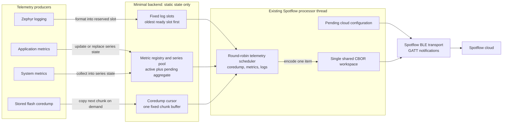

# Spotflow Minimal BLE Sample

This sample selects the BLE-only minimal telemetry backend for RAM-constrained
devices. It preserves the Spotflow cloud protocol while replacing allocated
telemetry queues with fixed log slots, coalesced metric state, and pull-based
coredump upload.

The minimal backend intentionally does not support generic application metric
labels or log body templates. Stack metrics retain one specialized `thread`
label whose value is a caller-owned static string. Log source names are limited
to 32 characters.

## Architecture

The minimal backend replaces independently allocated telemetry messages and
queues with bounded static state. The existing Spotflow processor thread pulls
one item at a time, serializes it into a single shared CBOR workspace, and sends
it through the BLE transport.



Only the processor thread uses the shared workspace and transport. Producers
never allocate telemetry messages: logs reserve a fixed slot, immediate metrics
replace an unsent value, aggregated metrics retain active and pending windows,
and coredumps are read one chunk at a time. Transport backpressure leaves the
selected item pending for retry with the same sequence identity.

Build for the TI CC2340R5 from this directory. On Windows, use a short build
directory because TI's generated RF object paths can exceed the toolchain path
limit:

```powershell
west build -b lp_em_cc2340r5 -p always -d C:\tmp\spotflow-minimal .
```

The selected backend is visible as
`CONFIG_SPOTFLOW_TELEMETRY_BACKEND_MINIMAL=y` in `build/zephyr/.config`.

The measured CC2340R5 memory allocation is documented in
[`MEMORY.md`](MEMORY.md).
